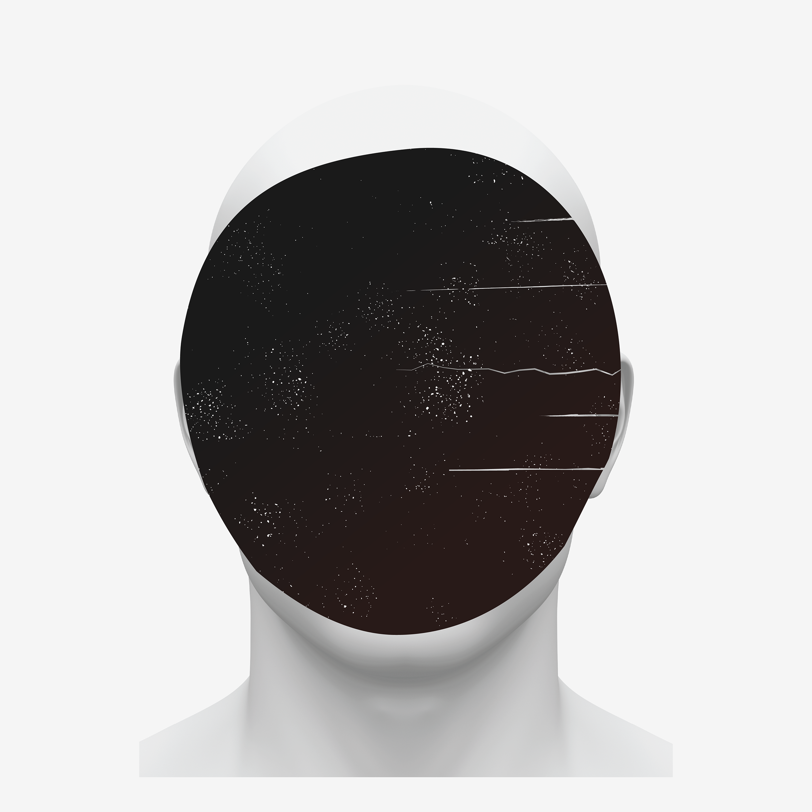
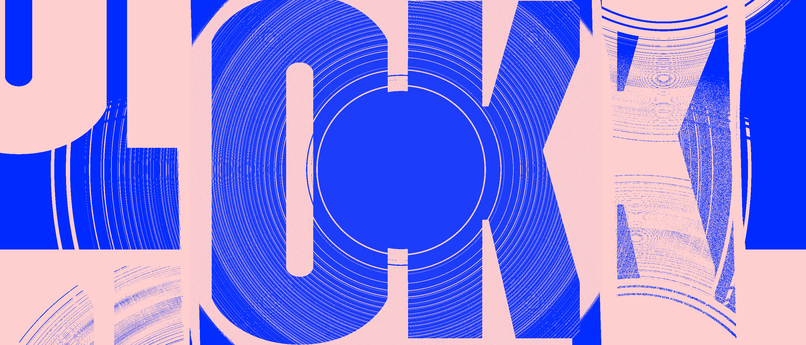

---
# Metadata
title: "European Hub"
type: "Branding, UI"

# Thumbnails
thumbnail: "./thumbnail.jpg"
og: "./og.png"

# Options
path: "/europeanhub/"
order: 4
---

<article role="article">

The last time I had spoken to the folks at [Citizens for Europe](https://www.citizensforeurope.eu/), I was working on [their brand and website](/citizensforeurope). Our relationship had always been very productive and personally rewarding, but after I left the company I was working for at the time we slowly lost touch. So when I got an e-mail from them about a new project, back in 2020, I was very excited.

They called it the European Hub for Civic Engagement and explained it was their answer to some of the issues they kept hearing civil society organizations across Europe bring up. They had already done a lot of the groundwork for it, including some early branding and user research, but were now in need of a partner to help them materialize those ideas. This felt like a perfect fit for [Odd Camp](https://odd.camp).

</article>

<article role="article">

The brief was clear enough: they had partnered with two other organizations ([Das Progressive Zentrum](https://www.progressives-zentrum.org/) and [Alliance4Europe](https://www.alliance4europe.eu/)) and set out to find what issues civil society organizations across Europe found the most challenging in their daily operations. The goal was to compile these issues and find ways to mitigate them through technology, by providing a set of tools and resources that these organizations could use for free. Their idea of what main problems these tools should tackle was already very clear at this point, yet their idea of how to get there was still vague.

After sitting through several meetings, and reviewing lengthy documents summarizing the outcomes of preliminary workshops they had already held, we agreed it would be wise to break the project down into smaller chunks. This would allow us to build the platform in a modular fashion, starting out from the most important features and slowly releasing new tools over time. The fact that they were calling it a "Hub" made it all the more fitting: this would not merely be a tool, but an ever-growing repository of multiple, interconnected tools. We agreed on an initial batch of four different tools (Community, Funding, Ideas, and Resources) and set out to design and build them in that order.

</article>

<article role="article">

</article>
