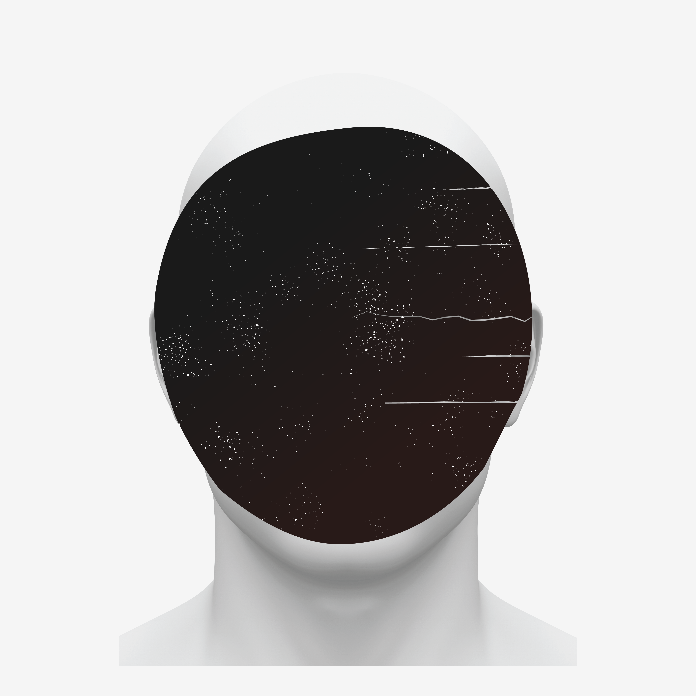

---
# Metadata
title: "BORE — 30"
type: "Music EP"

# Thumbnails
thumbnail: "./thumbnail.png"

# Options
path: "/30/"
order: 5
---

<article role="article">

I am, by no means, a musician. But I grew up surrounded by them: my father and older brother, who are both multi-instrumentalists, and the several musicians they've played with throughout their life. So, growing up, I had a pretty big incentive to pick up a guitar and dedicate part of my life to it. For some reason though, I never did. It seemed as though, for any sort of activity to pick my interest, it had to somehow be connected to a computer. So when a friend of mine introduced me to electronic music back in high school, something clicked. All throughout high school, I spent most of my free time experimenting with [Fruity Loops](https://www.image-line.com/flstudio/) and, even though I never made a career out of it, I've always looked back fondly at those long afternoons. Even as I was studying to become a designer, and especially after I've started working as one—at a time when I forgot what it meant to have free time.

It was not until I turned 30 that I decided I wanted afternoons like those again. To be immersed in my own world again, headphones on, time just flying by. So I set up a small studio in my office and restarted making music. I'm still rusty and trying to get the hang of it again. I traded Fruity Loops for [Ableton Live](https://www.ableton.com/en/live/), which made the task extra difficult, but I forced myself to send something out into the world before I turned 31. So on October 30th 2017 I put released a small EP, under the name BORE. I called it 30. It's an hommage to turning thirty and being scared shitless but still feeling insanely grateful and happy to be alive.

<iframe src="https://open.spotify.com/embed/album/5IeVUbqOvGMqY1vsSQVV6P" width="300" height="380" frameborder="0" allowtransparency="true" allow="encrypted-media"></iframe>

It's made up of 3½ instrumental tracks I composed and produced over the course of two months back in 2017. It's available on [Spotify](https://open.spotify.com/album/5IeVUbqOvGMqY1vsSQVV6P?si=l1lCUiuSQg29nnToPtEjMg), [Apple Music](https://itunes.apple.com/us/album/30-ep/1302089702), [Google Play](https://play.google.com/store/music/album/BORE_30?id=Befmhd4kzihyswra4hb5vxdwlq4), [Tidal](https://tidal.com/browse/album/80544698), [Deezer](https://www.deezer.com/en/album/50648552) and [Bandcamp](https://bore.bandcamp.com/releases).

The cover art is a small illustration I repurposed from an abandoned sideproject of mine, but that I felt fit the tone of the record perfectly.

</article>

