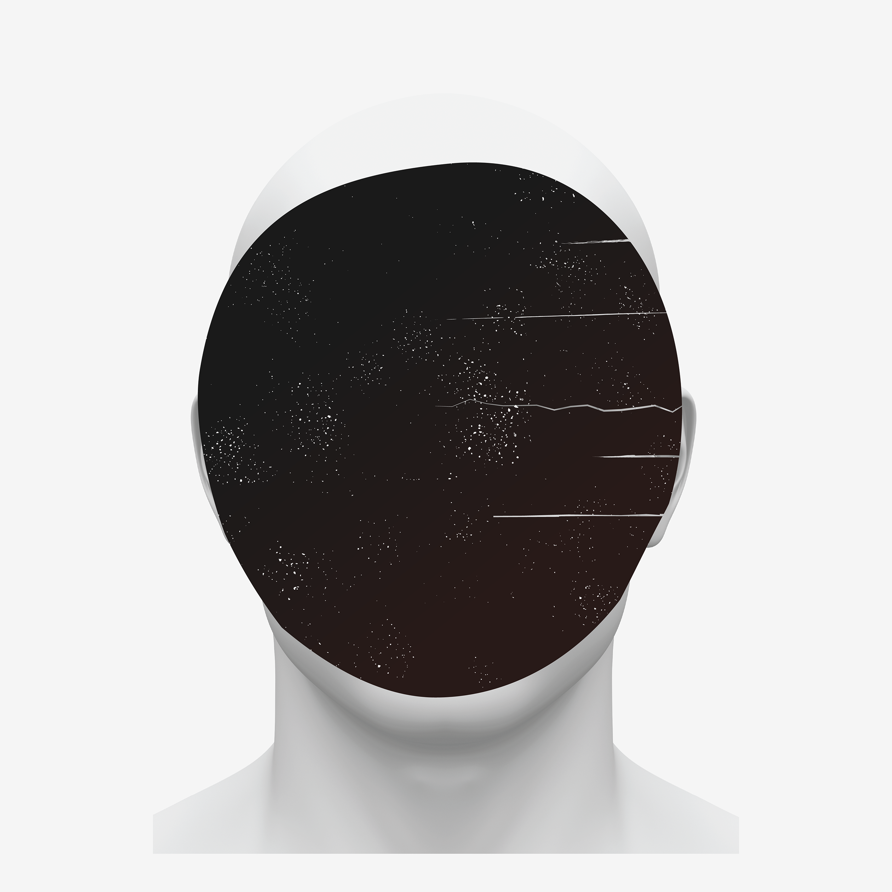
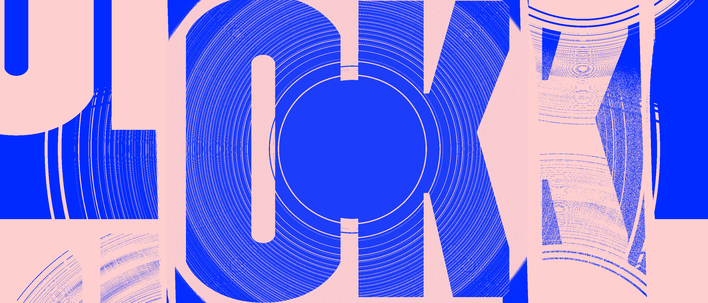

---
# Metadata
title: "BORE"
type: "Electronic Music"

# Thumbnails
thumbnail: "./thumbnail.jpg"
og: "./og.png"

# Options
path: "/bore/"
order: 6
---

<article role="article">

I am, by no means, a musician. But I grew up surrounded by them: my father and older brother, who are both multi-instrumentalists, and the several musicians they've played with throughout their life. So, growing up, I had a pretty big incentive to pick up a guitar and dedicate part of my life to it. For some reason though, I never did. It seemed as though, for any sort of activity to pick my interest, it had to somehow be connected to a computer. So when a friend of mine introduced me to electronic music back in high school, something clicked. All throughout my teenage years, I spent most of my free time experimenting with [Fruity Loops](https://www.image-line.com/flstudio/) and, even though I never made a career out of it, I've always looked back fondly at those long afternoons. Even as I was studying to become a designer, and especially after I've started working as one—at a time when I forgot what it meant to have free time.

> It was not until I turned thirty that I decided I wanted to have afternoons like those again.

To be immersed in my own world, headphones on, time flying out the window. So I set up a small studio in my home office and restarted making music. I'm still rusty and trying to get the hang of it again (switching to [Ableton Live](https://www.ableton.com/en/live/) meant I had to re-learn a lot of things) but I forced myself to send something out into the world before I turned 31. So on October 30th 2017 I released a small EP, under the name BORE. I called it 30. It's an homage to turning thirty and being scared shitless but still feeling insanely grateful and happy to be alive.

<iframe style="border: 0; width: 350px; height: 588px;" src="https://bandcamp.com/EmbeddedPlayer/album=1143290857/size=large/bgcol=ffffff/linkcol=1A1A1A/transparent=true/" seamless><a href="https://bore.bandcamp.com/album/30">30 by BORE</a></iframe>

It's made up of 3½ instrumental tracks I composed and produced over the course of two months back in 2017. It's available on [Bandcamp](https://bore.bandcamp.com/releases).

The cover art is a small illustration I repurposed from an abandoned side project of mine, which I felt fit the tone of the record perfectly.

</article>

<article role="article">

I don't have the time—nor, more importantly and tragically, the skill—to turn music into more than an hobby. I would even hesitate to call it a sideproject. But I find it extremely therapeutic, and have decided, for extremely selfish reasons, to force myself to send something out into the world at least once a year. Because it makes me sit down and give it the time, without feeling the guilt that comes with indulging myself.

2018 was a bit of a turbulent year for me, and I found it very hard to commit to this plan. But I managed to squeeze two new tracks out of the little free time I had, and released them as a single in early September. I called it OK—to remind myself that, sometimes, being average is good enough.

</article>

<article role="article">

<iframe style="border: 0; width: 350px; height: 522px;" src="https://bandcamp.com/EmbeddedPlayer/album=1731683899/size=large/bgcol=ffffff/linkcol=233CEF/transparent=true/" seamless><a href="https://bore.bandcamp.com/album/ok">OK by BORE</a></iframe>

The title track is a longer, perkier track than the stuff I'm usually into. It's my attempt at making a danceable track for people blessed with two left feet. 🕺

The second track gets its title from the portuguese word for Vinegar and was heavily inspired by a long-time favorite poem of mine: [Portugal](http://ensina.rtp.pt/artigo/portugal-de-jorge-sousa-braga/), by Jorge de Sousa Braga.

In 2019, I unfortunately couldn't find any time to keep the momentum going. And though a global lock-down sounds like the perfect excuse to put more hours into your sideprojects, by 2020 I was a newly-minted father and was (am? 🤔) still trying to get the hang of it. So nothing new for now. But one can dream...

</article>
