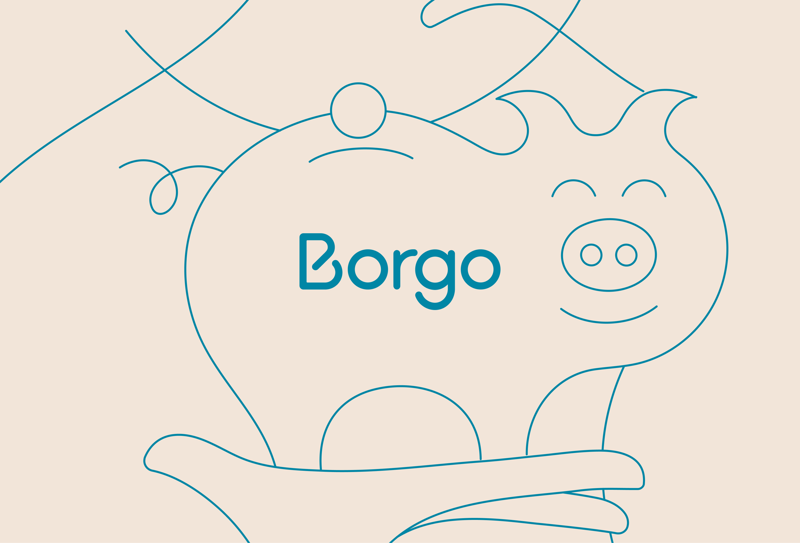
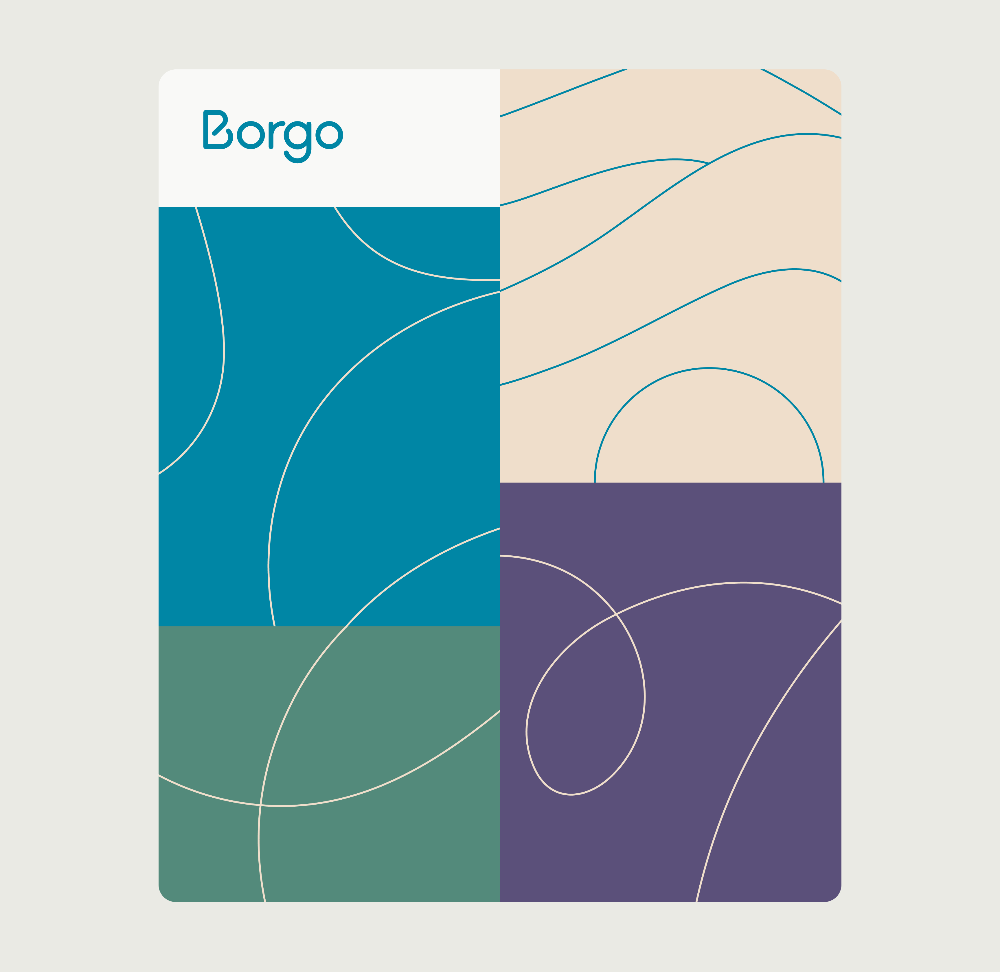
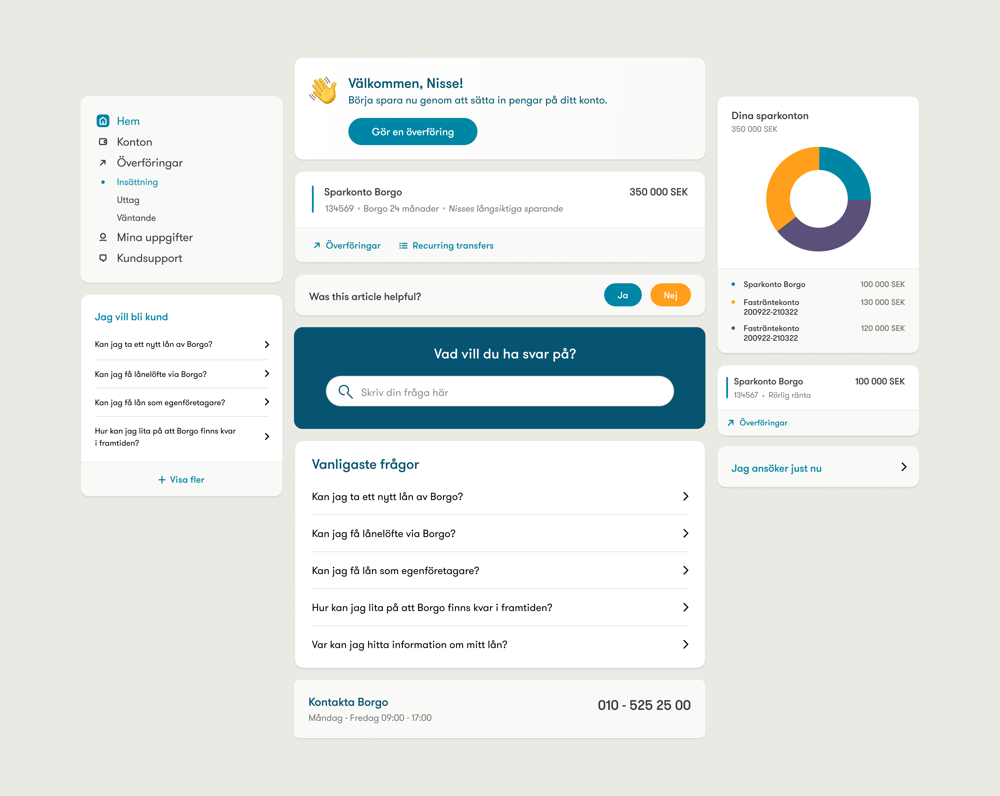
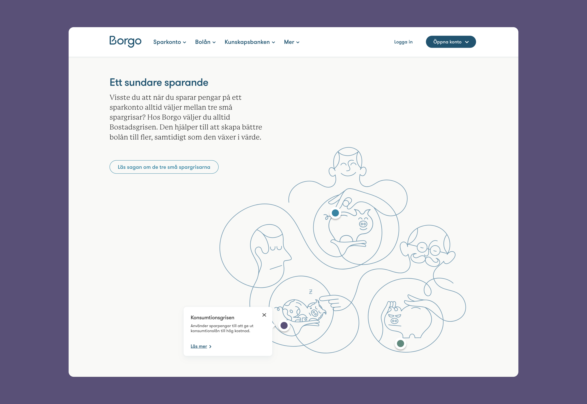
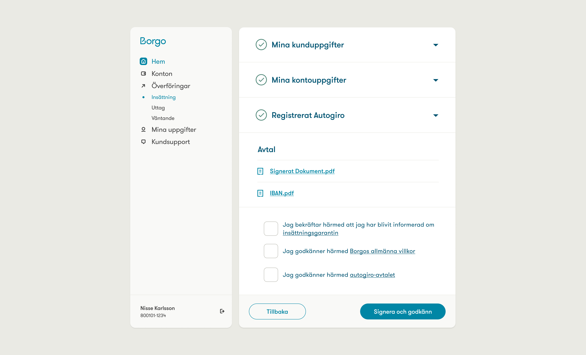

---
# Metadata
title: "Borgo"
type: "Branding, UI, Frontend"

# Thumbnails
thumbnail: "./thumbnail.jpg"
og: "./og.png"

# Options
path: "/borgo/"
order: 2
---

<article role="article">

Borgo is a Swedish fintech start-up. Originally founded as a mortgage aggregator, they were eventually handed a license to provide a wider range of financial services by Swedish legislators. That's when it became clear they would need to adapt their existing brand to fit the new strategy—with a matching website and app. I was lucky enough to help lead that project while at [Odd Camp](/oddcamp).

</article>

<article role="article">

Their original brand had been designed by another agency, not long before we were brought in. It revolved heavily around the logotype and a set of single-stroke illustrations by [Jonathan Calugi](https://www.behance.net/Lovers). It was pretty good but, because it had been designed for a company with a much smaller range of services than Borgo was about to become, it had a few shortcomings.

> So we sat down with the client, walked them through some of the brand's limitations, and explained what we could do to overcome them.

We suggested not a rebrand, but an upbrand—scaling the existing brand to more adequately match Borgo's new goals, ambitions, and challenges. We kept the existing core elements (logo and illustrations) and expanded outwards from there. We tweaked the color palette to fit their tone of voice, added a serifed typeface to expand their typographical range, and developed ways to combine everything into coherent yet flexible compositions.

</article>

<video controls muted playsinline preload="metadata" poster="/videos/borgo/brand.png">
  <source src="/videos/borgo/brand.mp4" type="video/mp4" />
</video>

<article role="article">

It's not uncommon for the line between branding and UI design to be blurred on projects like this. That was very much the case here: as we began to prototype, we started to develop a library of UI components that not only inherited heavily from the branding work but also fed design decisions back to it, influencing the end result. I like to think this helped make all aspects of the brand feel whole, while at the same time being mindful of the requirements and affordances of each medium—website, application, social media, and corporate communication channels, among others.

Every aspect of the interface was componentized in Figma, and then implemented as [ViewComponents](https://viewcomponent.org/). This ensured consistency across all areas of the service, but still allow for flexibility to be dialled into every component—enabling most of them to be easily employed in different contexts with minimal adjustments required.

</article>

<video controls muted playsinline preload="metadata" poster="/videos/borgo/app.png">
  <source src="/videos/borgo/app.mp4" type="video/mp4" />
</video>

<article role="article">

The brand, website, and application were first released in 2021. From then onwards, I kept a close relationship with the client and the project, helping to maintain and evolve all aspects of their service until 2023, when we decided to shut down Odd Camp and I went on to pursue other interests. By then, Borgo's services had matured, so we were able to hand the project over to a new agency, who picked up where we left off. All in all, it was a fantastic experience, that I'll always look back fondly on.

</article>