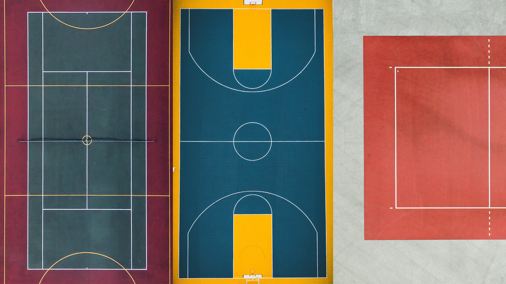

---
# Metadata
title: "Citizens for Europe"
type: "Branding + Web"

# Thumbnails
thumbnail: "./thumbnail.svg"

# Options
path: "/citizensforeurope/"
order: 6
---

<article role="article">

Citizens for Europe is a platform for European-based citizens and civil society organisations to share ideas and engage one another in helping shape democracy in an increasingly estranged Europe. Made up of just under 300 NGOs, the platform needed a new visual identity and website that allowed it to not only increase its social outreach, but also actively promote communication between its existing members. When they approached me asking for help, I was working at [FBA.](http://www.fba.pt/), so I enlisted their help.

</article>

<article role="article">

We 

</article>