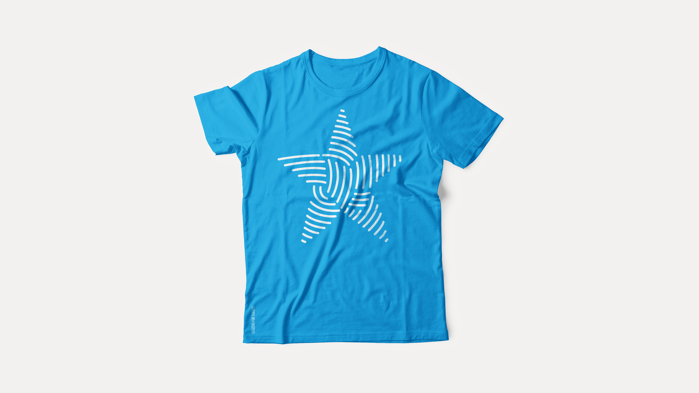
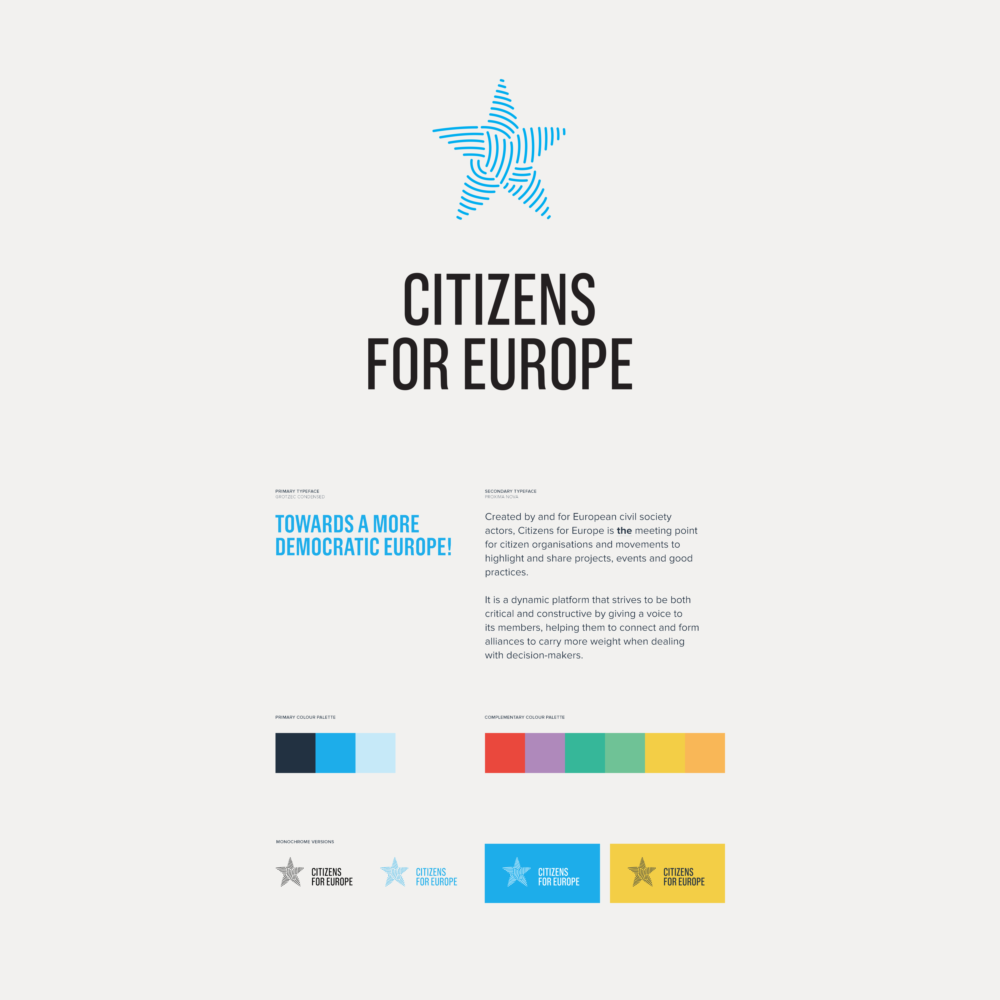
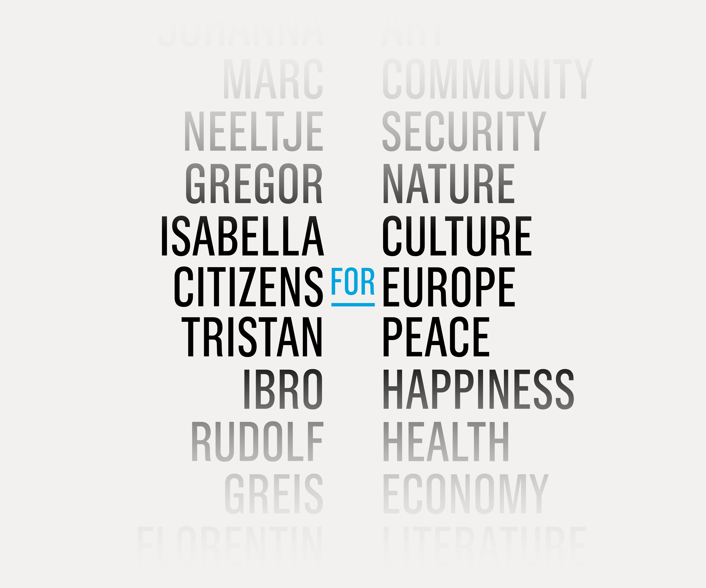
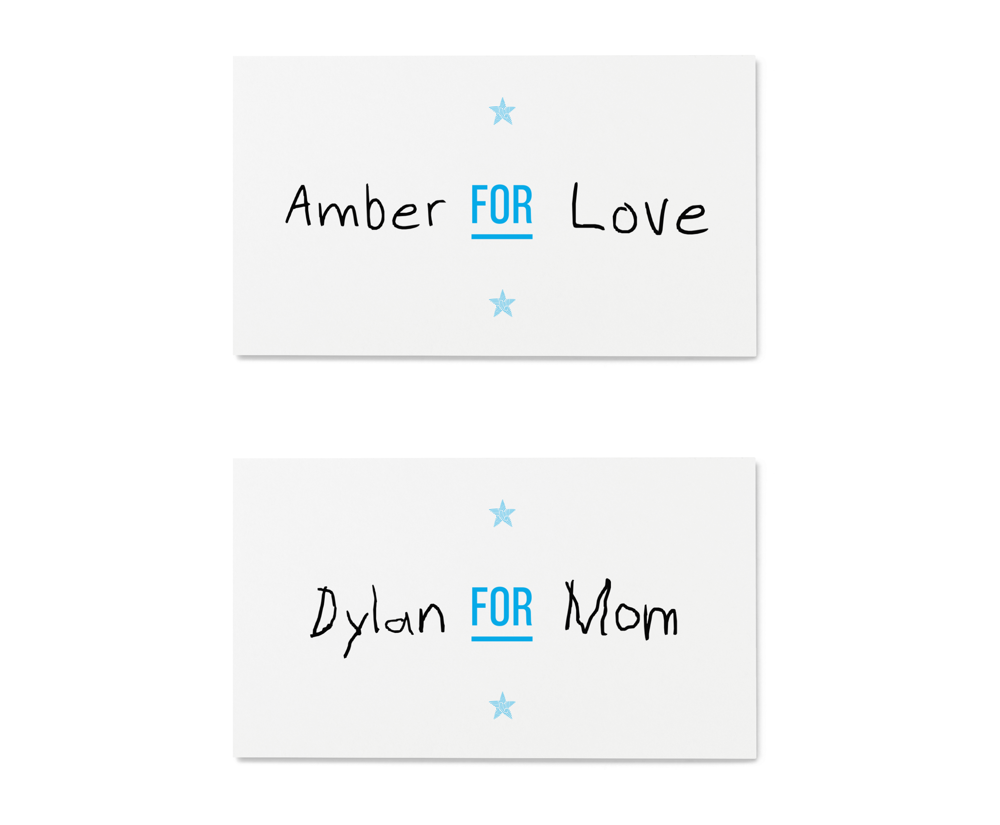
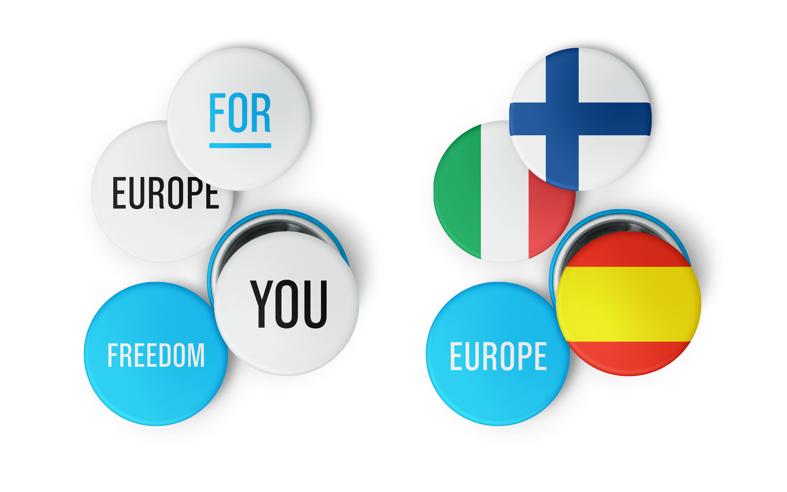
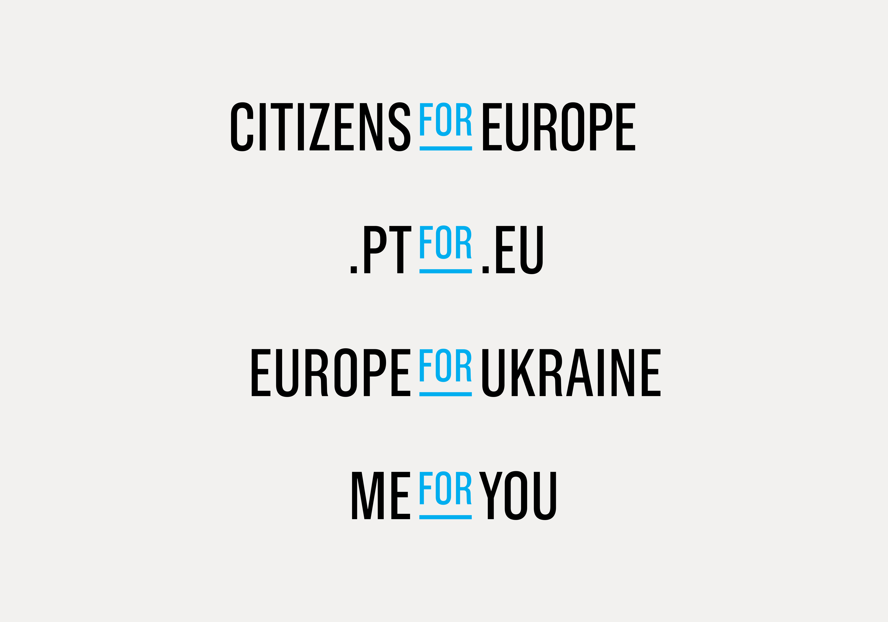
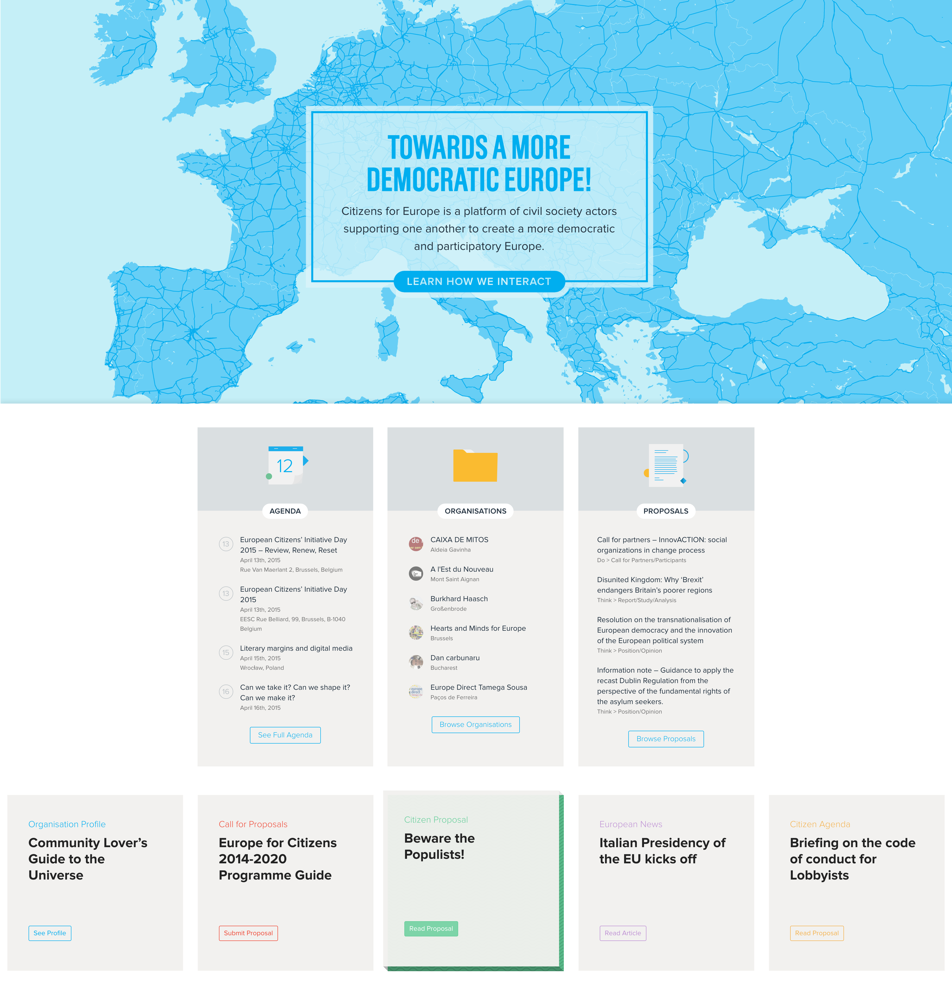
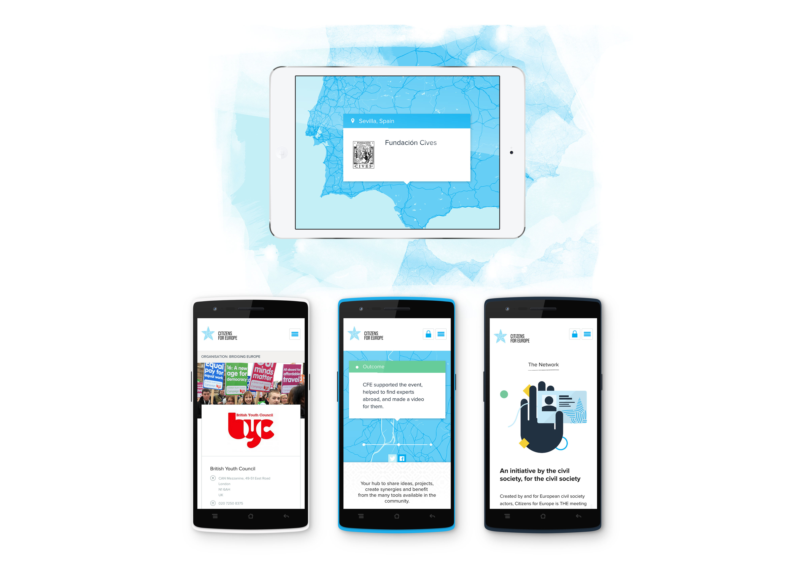

---
# Metadata
title: "Citizens for Europe"
type: "Branding + Web"

# Thumbnails
thumbnail: "./thumbnail.svg"
og: "./og.png"

# Options
path: "/citizensforeurope/"
order: 6
---

<article role="article">

Citizens for Europe is a platform for European-based citizens and civil society organisations to share ideas and engage one another in helping shape democracy in an increasingly estranged Europe. Made up of just under 300 NGOs, the platform needed a new visual identity and website that allowed it to not only increase its social outreach, but also actively promote communication between its existing members. When they approached me asking for help, I was regularly collaborating with [FBA.](http://www.fba.pt/), so I worked together with them in bringing the brand and Website to life.

</article>

<article role="article">

The idea for the logo popped up soon after I saw the first sentence in the briefing documents we were handed. It read:

> “Citizens for Europe is an organisation run for and by citizens, working together towards a more participative and democratic Europe”

I highlighted the words citizens, together and Europe, and went looking for things that could broadly convey those concepts. Europe was quite obvious: one of the stars in the European flag. It was actually almost too obvious, and we debated whether we should resort to that kind of cliché or try to find something a bit more nuanced. In the end, though, we stuck to it, because it pieced together nicely with the other elements: fingerprints woven together, representing both citizenship and unity.

I'll admit it sounds a bit far-stretched when you try to explain the concept. And the first few sketches I came up with didn't exactly help the cause, as they looked either forced or boring. But right as I was about to give up, things seemed to fall into place. I had a logo I was actually quite happy with, and that I felt managed to combine all three concepts into a single image.

</article>

<article role="article">

The original proposal had an additional detail we ended up having to drop. At the time, I was looking for ways to increase engagement with the target audience, and I figured there was a clear opportunity to do it right in the organisation's name.

> If you simply replace the words Citizens and Europe, you can use the logo as a vessel for any personal or political message you want to broadcast.

To allow for the brand not to get lost in the process, the word "for" was styled differently in the original logo, so that even when you take away the star and replace two-thirds of the name, the brand is still recognizable.

</article>

<iframe class="video" src="https://player.vimeo.com/video/261192178?autoplay=1&loop=1&title=0&byline=0&portrait=0" width="4800" height="2700" frameborder="0" webkitallowfullscreen mozallowfullscreen allowfullscreen></iframe>

<iframe class="video" src="https://player.vimeo.com/video/261192083?autoplay=1&loop=1&title=0&byline=0&portrait=0" width="4800" height="2700" frameborder="0" webkitallowfullscreen mozallowfullscreen allowfullscreen></iframe>

<article role="article">

In the end, we dropped the idea because we thought it was a logo in its own right and that it would ultimately steal the spotlight away from the star. We felt like keeping both things would equate to having a logo that's actually made out of two different logos, so we had to choose one—and the star ultimately won. But I'm still very fond of this concept, and think it would really have shined at the several events Citizens for Europe regularly organizes across Europe.

What we did keep was Mário Feliciano's stellar [Grotzec Condensed](http://www.felicianotypefoundry.com/cms/fonts/grotzec-condensed)—a font that turns anything it's typeset with into pure gold.

</article>

<article role="article">

Finally, we designed and developed a Website that serves as the main hub of communication between the various members of the community. The biggest challenge here was turning what is basically a regular WordPress site into a social network of sorts. Organisations should be able to create and maintain their own public profile, as well as submit events, resources and proposals for other members to read and comment on. Under the hood, organisations should also be able to exchange messages between each other directly through the platform, and hopefully forge new partnerships that help shorten the distances between EU member states.

To do all of that, we got designer & developer [João Saraiva](https://concealed.pt/) to help us turn a static template into a full-fledged WordPress theme, complete with custom sign up flows and its own content management system for organisations to be able to submit and manage their own content on the Website. Thanks to his work, we managed to build a powerful multi-user application on top of what is essentially a blogging platform.

</article>

<article role="article">

> For a Website originally launched in early 2015, I think it has aged quite well.

It's still actively used by Citizens for Europe's now [more than 400 members](http://www.citizensforeurope.eu/organisations/), and new content is published on a daily basis. The site's main goals are also still as relevant as ever—if not more—and will continue to be in a post-Brexit world, so it's comforting to see CFE are still actively trying to build a better European Union.

</article>
