---
# Metadata
title: "Echo1"
type: "Branding + Web"

# Thumbnails
thumbnail: "./thumbnail.svg"

# Options
path: "/echo1/"
order: 2
---

<article role="article">

Echo1 is a Singapore-based company working towards improving sound culture across the globe. They manage and fund businesses working in sound-related areas, while at the same time promoting good business practices within the companies they are involved in. Together with the brilliant folks at [Kollegorna](https://www.kollegorna.se/en/), I helped build their brand and website in record-time, going from an humble pitch deck to release in just a few of weeks.

</article>

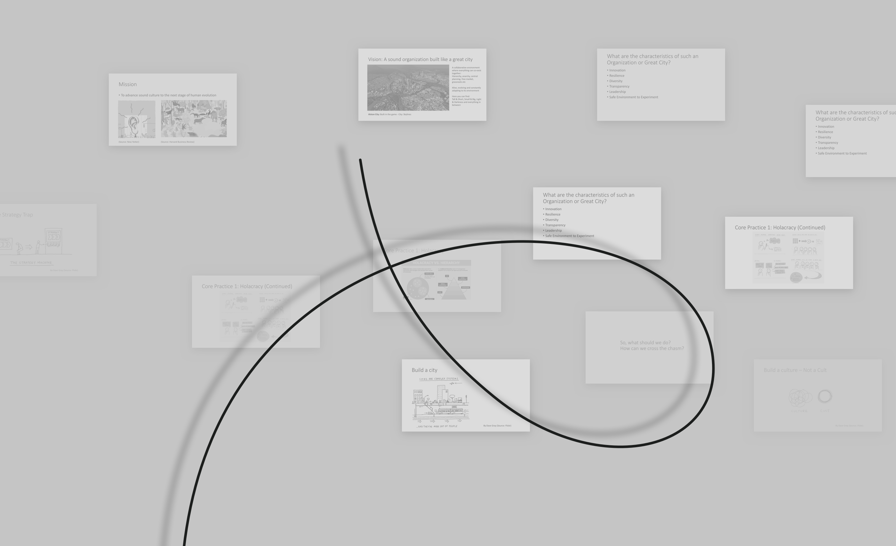
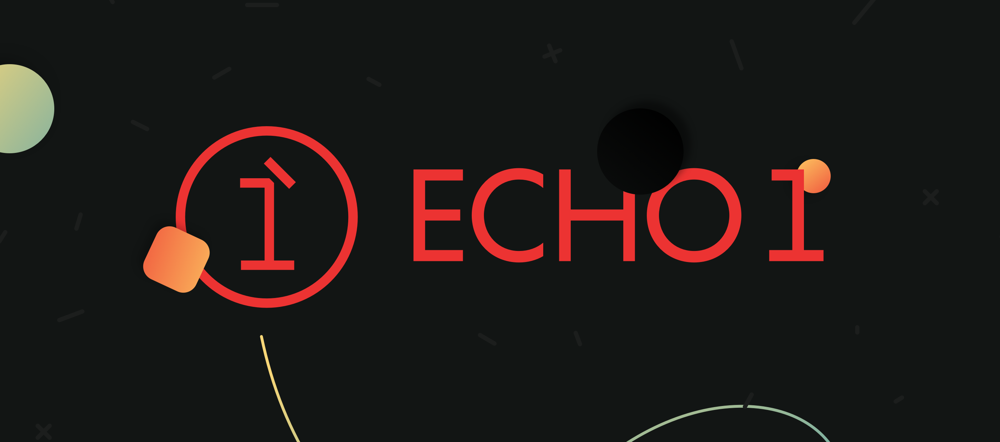

<article role="article">

When they first approached us, Echo1 had a bold vision for what the company of the future should look and behave like. I already knew Adrian Lo, the founder, from previous projects we had worked on together, and I was aware of his stellar work ethic and the tireless work he put into all of his ventures. But this time he was looking to do some things slightly different. He was trying to build something bigger. He wanted his new company to be as transparent, diverse and holacratic as possible, and was looking to completely abolish hierarchies. His vision was that of a network where the power traditionally reserved for executives and managers would be equally spread across all employees. And he wanted us to design and build a website that put the ideology behind it front and center, while also fulfilling the more traditional role of promoting his company's services and portfolio.

The idea of building organisations void of hierarchy sounded very exciting, but we also felt as though it could easily come to be dismissed as impractical and utopic by their target audience. So we set out to build a brand and website that felt fun and approachable, but still looked poised, serious and mature. We figured this would help get the message across, and circumvent any possible skepticism or animosity people could have towards a business that is looking to blow up the traditional image of what a company is.

</article>

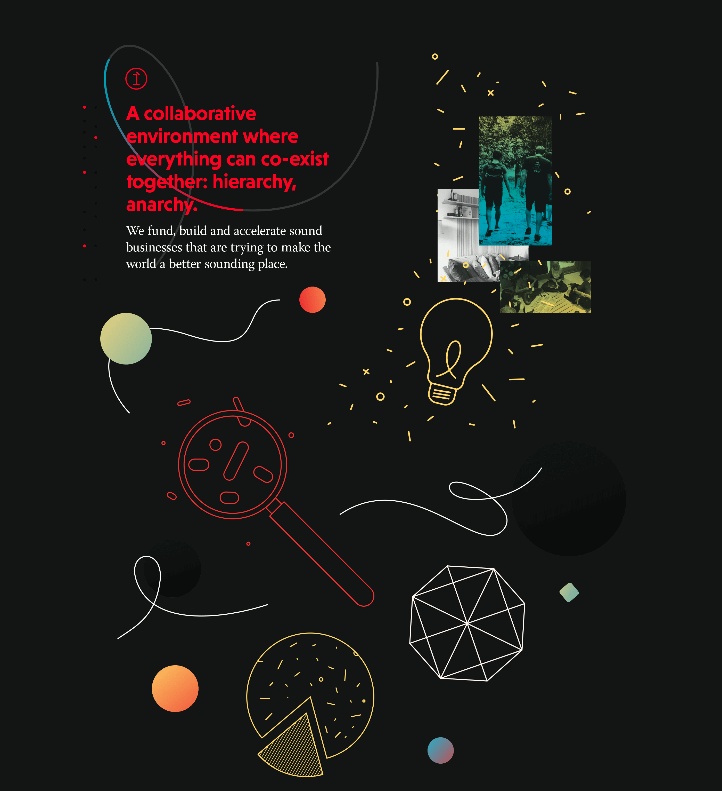
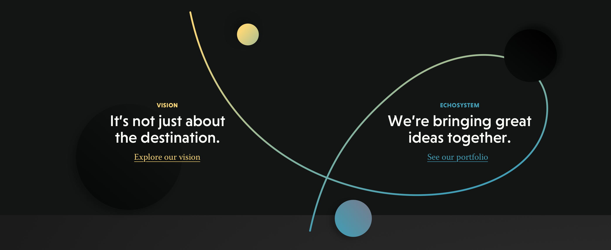
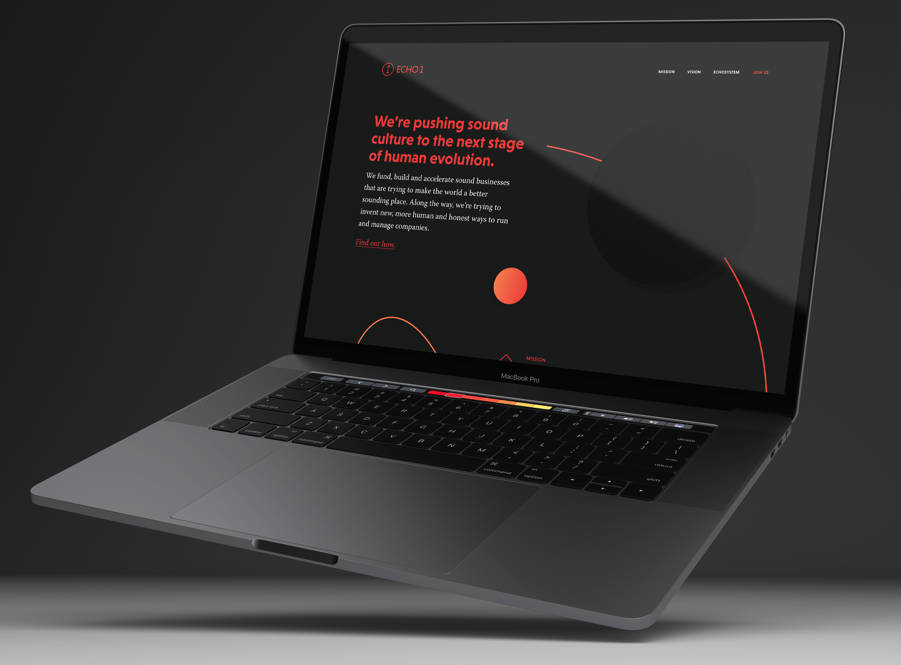

<article role="article">

We were brought on to the project at a very early stage of the company's inception—a time when they had a very clear image of how they wanted to operate, but were still unsure about the sort of businesses they would be investing on. So we had to build a brand that looked interesting and established some sort of connection with the company's core businesses, but was still broad and generic enough to allow for the company to explore several different business areas without feeling like they needed to rebrand every single time. All of this without being able to rely on any type of imagery — no product photos, no headquarters and no team photos.

Our solution was to come up with a brand system that relied heavily on basic shapes, with a single line running through all of them—keeping everything connected, even if it means following the least obvious of paths. These were paired with a set of warm gradients and snappy animations, which we employed exhaustively [throughout the website](https://www.echo1.co) and the brand applications, creating a tight and easily recognisable brand that can evolve gracefully over time, as the products and companies Echo1 invests on begin to shape the company's values more clearly.

These shapes and colours are complemented by [a quirky sans-serif font](https://www.hvdfonts.com/fonts/niveau-grotesk) for the headings, paired with [a serifed font](https://typekit.com/fonts/warnock) that's sobering but full of personality for body copy.

</article>

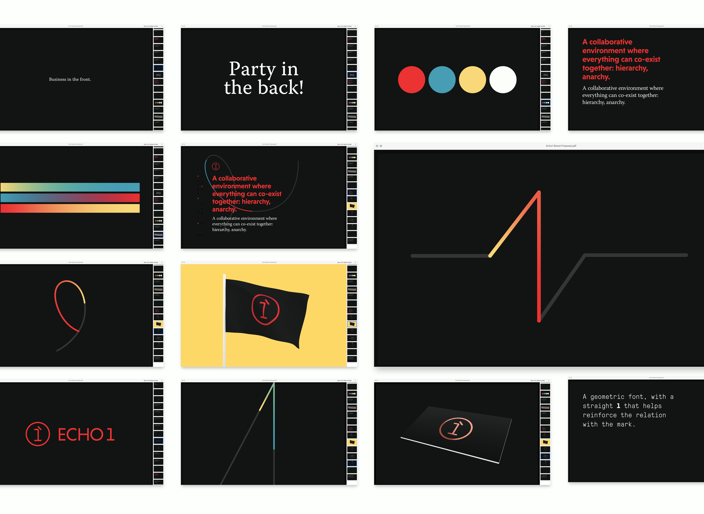
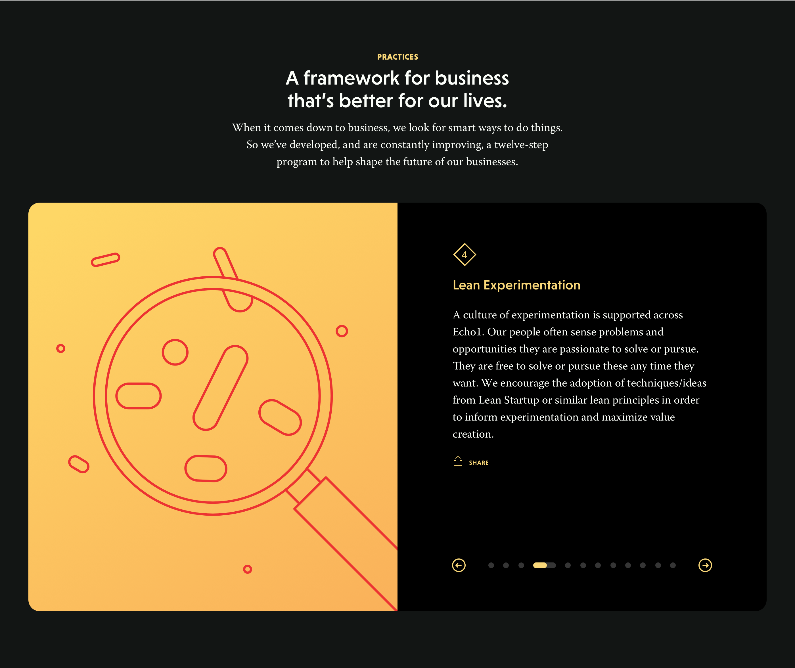

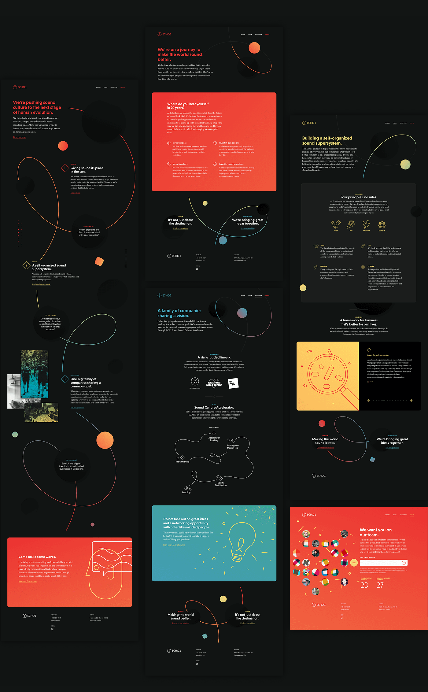
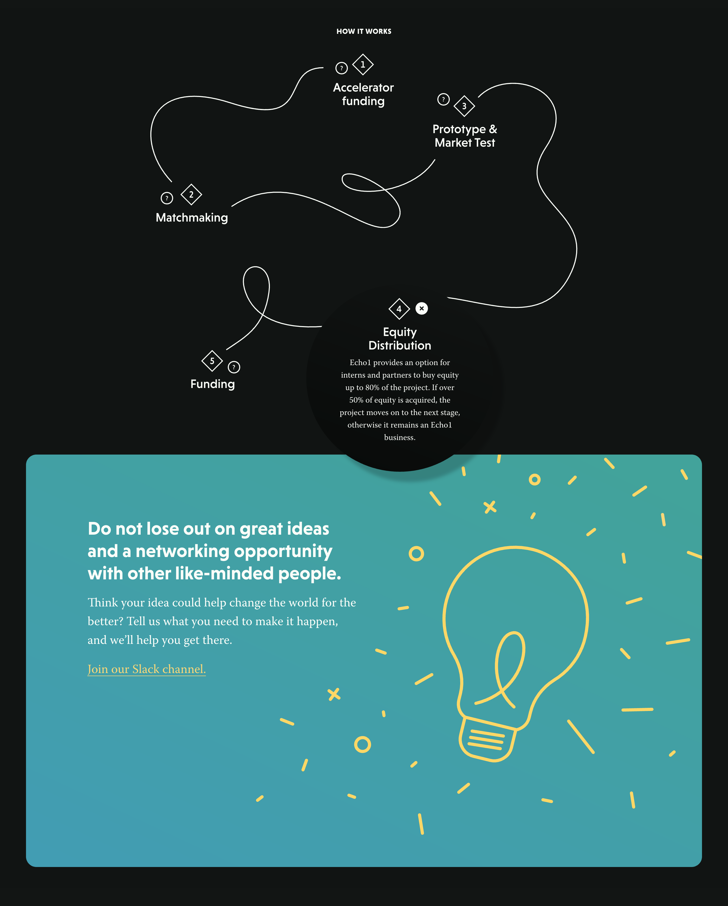
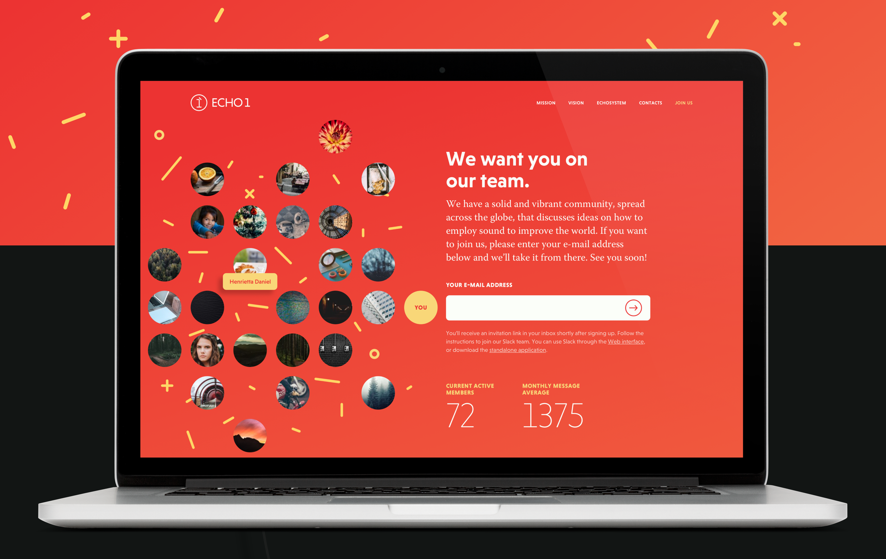
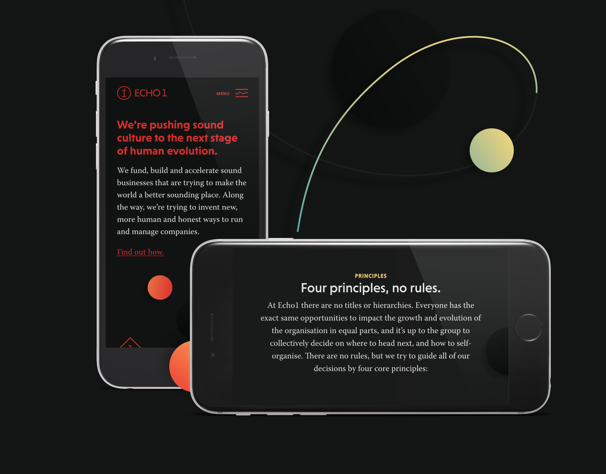
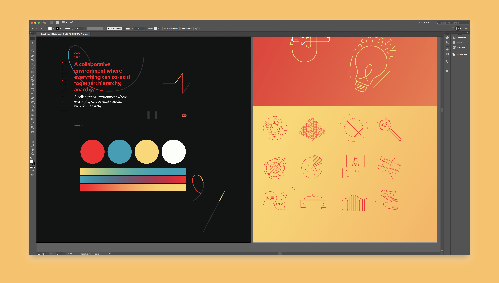

<article role="article">

The brand and Website are, of course, just the start for Echo1. They are now actively seeking to gather a team of investors, researchers and entrepreneurs willing to establish new businesses that help improve sound and acoustics throughout the world. They have created a Slack channel where [everyone is invited](http://echo1.co/join-us) to share their ideas with the rest of the team and ask for help (financial or otherwise) making them happen.

</article>