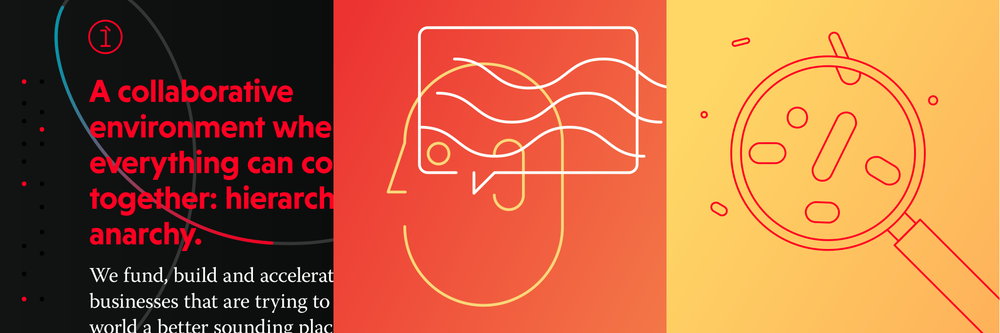

---
# Metadata
title: "Echo1"
type: "Branding + Web"

# Thumbnails
thumbnail: "./thumbnail.svg"

# Options
path: "/echo1/"
order: 2
---

<article class="copy" role="article">

Echo1 is a Singapore-based company working towards improving sound culture across the globe. They manage and fund businesses working in sound-related areas, while at the same time promoting good business practices within the companies they are involved in. Together with the brilliant folks at [Kollegorna](https://www.kollegorna.se/en/), I helped build their brand and website in record-time, going from an humble pitch deck to release in just a few of weeks.

</article>

<article class="copy" role="article">

When they first approached us, Echo1 had a bold vision of what the company of the future should look and behave like. I already knew Adrian Lo, the founder, from previous projects we had worked on together, and I was aware of his stellar work ethic and the tireless work he put into all of his ventures. But this time he was looking to do some things slightly different. He was trying to build something bigger. He wanted Echo1 to be as transparent, diverse and holacratic as possible, and was looking to completely abolish hierarchies. His vision was that of a network where the power traditionally reserved for executives and managers would be equally spread across all employees. And he wanted us to design and build a website that put the ideology behind it front and center, while also fulfilling the more traditional role of promoting his company's services and portfolio.

The idea of building organisations void of hierarchy sounded very exciting, but we also felt as though it could easily come to be dismissed as impractical and utopic by their target audience. So we set out to build a brand and website that felt fun and approachable, but still looked poised, serious and mature. We figured this would help get the message across, and circumvent any possible skepticism or animosity people could have towards a business that is looking to blow up the traditional image of what a company is.

</article>