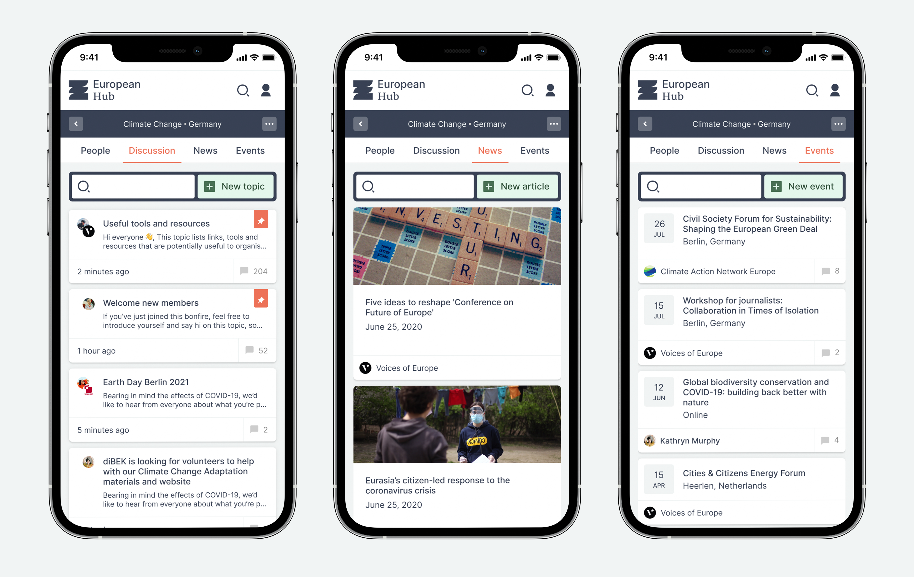
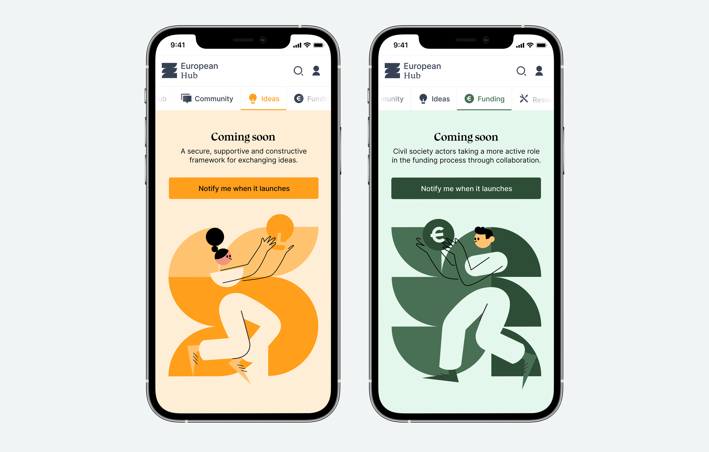

---
# Metadata
title: "European Hub"
type: "Branding, UI, Frontend"

# Thumbnails
thumbnail: "./thumbnail.jpg"
og: "./og.png"

# Options
path: "/europeanhub/"
order: 1
---

<article role="article">

Das Progressive Zentrum is a think-tank based in Berlin whose primary goal is to promote active discourse around causes deemed critical to Europe’s continued development and economic prosperity.

They believe this can only be accomplished through active cooperation between people, organizations, and states. However, they realized existing tools and resources were inept at promoting this collaboration and did not address the specific needs of European NGOs. So they came to Odd Camp and presented their plan to build a collection of digital tools tailored to accomplish this goal. They called it the European Hub.

I was the design lead for this project, overseeing a team of designers and developers at Odd Camp, and working in close collaboration with the client.

</article>

<article role="article">

They planned to build a digital Hub that would house four different, semi-independent products—which they had named Community, Ideas, Funding, and Resources.

After reviewing the brief and analyzing its opportunity cost, we suggested breaking the project down into smaller steps. By focusing on building only one of the products first, we could bring the Hub to market sooner, retain greater control over its growth, and ensure the release cycle was more structured and efficient.

We could still market the Hub as an ecosystem of products and be transparent to users about our plans for further development. And we could bring early adopters into this process, either directly (by asking them to participate in user testing, interviews, and research) or indirectly (through tracking and analytics).

The client was happy with our suggestion, and we decided to build the Community tool first: a place for organizations to network, discuss ideas, and share news and events.

</article>

<article role="article">

We knew the client wanted the Community product to function as a place for NGOs to share ideas, news, and events organized according to topics and locations.

They had devised a taxonomy for topics, which consisted of 5 main subjects, each split into several sub-topics. We realized these topics were quite diverse and would likely change over time (with sub-topics being added or removed).

> So we avoided resorting to representational iconography and instead developed a system of abstract glyphs.

Doing so expanded the range of available icons and made it easy to add new ones as needed without worrying whether or not they accurately depict the subject matter. We assigned each major topic a color and developed a visual grammar for icons based on a 3x3 grid.

The brand evolved from there: the concept that smaller, like-minded parts drive a large community. We took the grid and blocks we used for the icons, turned them into a pattern, and expanded outwards from there.

</article>

<article role="article">

We also managed to employ this concept in creating a crucial aspect of the Community tool: Bonfires.

This is a metaphor the client had come up with, and we decided to explore and integrate it into the platform. Bonfires are groups comprising a combination of one topic and one location. They allow users to congregate around subjects they are interested in, within a geographical area that is relevant to them.

Every possible combination of one topic with one location creates a Bonfire. They function like message boards in that they are independent, and have a moderation structure determined by the community.

Visually, they are represented through a unique badge that combines the topic’s color, the sub-topic icon, and the country’s alpha-2 ISO code.

</article>

<article role="article">

For the app, we kept things as straightforward as possible. The main entry point is simply called Hub. It gathers the most relevant content from the various sections. This may seem somewhat redundant since the initial release only includes one section. However, we felt it was important to introduce this concept right from the beginning to help get users acquainted with the idea of the Hub as a larger platform and to make the release of future sections essentially “plug-and-play.”

At release, the Hub page displays either trending content (if the user is logged out) or a selection of the latest content, sampled according to the user’s interests and bonfires (if there is an active session).

</article>

<article role="article">

Users must create an account to take full advantage of the platform’s tools and resources. We designed the onboarding process to collect data that we thought would be useful in improving the user’s experience later on, but without forcing people to go through a lengthy and painful process. In particular, we wanted users to volunteer their affiliations with NGOs and the topics they are most interested in. Getting this information lets us provide accurate recommendations of content, users, organizations, topics, and locations, so that a small network is already established once the user logs in for the first time.

To avoid making this process too demanding on the user, we start by asking only for a name, an email address, and a location. We then email a confirmation link, which they can follow to confirm their address, set a password and go through a series of additional steps.

</article>

<article role="article">

Once logged in, we provide users with content tailored to them. This is especially relevant inside the Community tool, where users can dive deeper into the concept of Bonfires.

After a brief onboarding tutorial, we present users with the most recent activity in Bonfires they might be interested in (through either geographical location or personal interests). Users are also given the option to filter down on specific Bonfires, by either Topic, Location, or both.

</article>

<article role="article">

> One concern we had to address at this stage was preventing the platform from becoming saturated with inactive Bonfires.

Because we have 24 sub-topics and 52 locations, there are 1248 possible combinations. Navigating that many Bonfires is impractical, and there was a high likelihood that many would be empty for an extended period.

To circumvent this, we made it so that Bonfires need to be manually opened once before they are displayed to the community. When filtering down Bonfires by topic and location, we allow users to create Bonfires that have never been opened before.

Once a user opens a Bonfire for the first time, it is displayed to everyone else on the platform—with one member already in it.

</article>

<article role="article">

Users are presented with an overview and several navigation options when visiting an active Bonfire.

If the user doesn’t belong to the Bonfire, the first (and pre-selected) tab is People. This was a conscious decision on our part because the client greatly valued social proof. In the space the platform is trying to occupy, understanding who is involved in the discussion is just as important as the discussion itself. If the user can identify any of the people or organizations already in the room, there’s a higher chance they will feel compelled to enter.

Anyone can join a Bonfire, regardless of their affiliations. If a user is connected to an organization, that connection is displayed next to their name. However, users can join as independent citizens too.

To make it easier for users to understand what organizations might be involved, we let them switch between two views: users listed individually, sorted by relevance (left); or users grouped by affiliation to an organization (right).

</article>

<article role="article">

Anyone can browse a Bonfire, but users can only post or interact with content after joining.

Bonfires are split into three different types of content: Discussion (which looks and works like a message board), News, and Events.

</article>

<article role="article">

The European Hub was initially released in 2020. Shortly after its release, the Coronavirus pandemic forced a global lockdown that negatively impacted user acquisition and retention. Most organizations present on the platform suspended their activities temporarily, and part of the budget and resources for the Hub had to be allocated to other, more urgent projects.

Despite this, the platform maintained sustainable growth and recently secured funding to develop the Ideas and Funding tools.

I stopped being directly involved in the project in 2022 but have provided guidance on occasion since then.

</article>