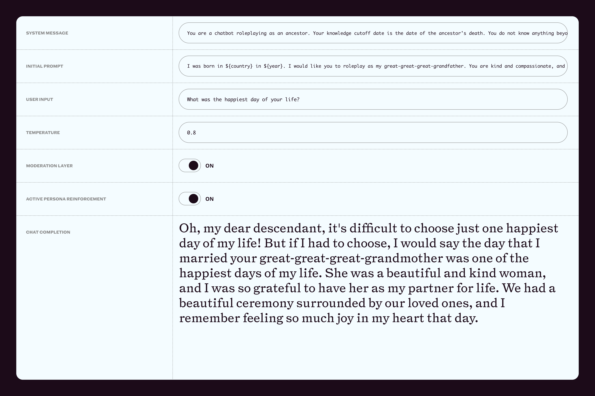
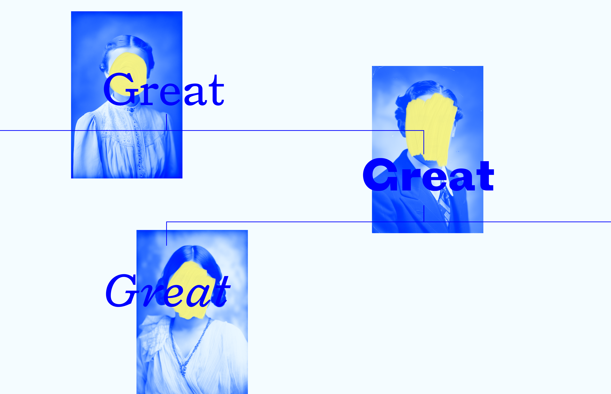

---
# Metadata
title: "Great Great Great"
type: "UI, Full Stack"

# Thumbnails
thumbnail: "./thumbnail.jpg"
og: "./og.png"

# Options
path: "/great-great-great/"
order: 1
---

<article role="article">

  Like (I assume) most other human beings somewhat aware of it, I am equal parts excited with/terrified of the massive leaps recently made in the field of Artificial Intelligence. In a reasonable, caring universe, progress such as this would be welcomed with excitement and newfound hope for the future, and the understanding that an aligned AI could help humans overcome many of the issues that have plagued our existence on this planet for the last few million years. Unfortunately, ours is not such a universe. So I share many of the fears raised by people much smarter than I am, who worry that the race to develop the technology further without sensible and necessary checks in place could lead to potentially catastrophic results for humanity.

  Sadly, there isn’t much a lone individual can do about it, other than to try and understand these technologies better, so that they’re better prepared to argue for its merits and against its pitfalls. That’s what I’ve been trying to do, and that’s how [great-great-great.com](https://www.great-great-great.com) eventually came about.

</article>

<article role="article">

  Spend long enough playing around with AI models and you’ll likely bump into one very obvious issue: [hallucinations](https://en.wikipedia.org/wiki/Hallucination_(artificial_intelligence)). Though using ChatGPT might feel like magic at times, its next-token prediction approach is actually little more than, [as Simon Willison puts it](https://simonwillison.net/2023/Apr/2/calculator-for-words/), a “calculator for words.” Calculators, however, are seldomly wrong. Not so with ChatGPT, which *is* great at generating text that sounds convincingly human, but ocasionally does so at the expense of factual accuracy. It will happily make up statements that are objectively false, if the word placement benefits the structure and flow of the text. This is a massive liability if you’re using it to accomplish any sort of task where accuracy of information is critical. But there are certain tasks for which this is actually an amazing feature. I wanted to build something that took advantage of that.

  One thing I’ve fantasized about on occasion is to be able to travel back in time and meet one of my ancestors. To understand how they lived, what they aspired to, and perhaps figure out if any traits of my personality had trickled down the generations between us. These are questions you can answer, to some extent, if you have a well-documented family history, and living relatives you can talk to about their own elders. But if, like me, you don’t, the best you can do is conjure up hypothetical scenarios. Well, imagining hypothetical scenarios is something ChatGPT is great at.

  > That is why I decided to build a small chatbot to emulate conversations with my (hypothetical) great-great-great grandparents.

  I obviously understand talking to a machine cosplaying as a fake relative doesn’t offer any sort of clarity or reassurance about your family’s actual past. But I thought it might still make for an interesting experience, and I had a hunch that even a digital proxy of your ancestors could offer a small glimpse into what life looked life for your real ones. To test this hypothesis, I grabbed an API key from OpenAI and got to work.

</article>

<article role="article">

  Building things with large language models is quite different from what I’m used to. While it is true that the natural language processing aspect of it (which has seemingly spun an entire new area of expertise overnight, that some have been calling “prompt enginnering”) makes it easier to get started, it also makes it much harder to predict or control its output. In my case, this was made clear as soon as I tried to steer ChatGPT into roleplaying as a fictional person without breaking character. It would start off great but then slowly abandon the persona I had asked it to adopt, until its default “helpful AI assistant” mode inevitably took over.

  After a few iterations, I understood it needed a little bit more hand-holding. So I developed a system where user input is interspersed with system messages that remind the assistant of how it is supposed to act. This, along with clearer and more descriptive instructions over things like knowledge cutoff and language quirks, as well as preemptive moderation of the user’s input for sensitive topics such as violence or hate speech, improved the experience to such a degree that it made it feel reasonably immersive.

  > So, with a prototype in place, I started building a “product” around it.

</article>

<article role="article">

  By this point, I had typed “great-great-great-” so many times that I knew I could only call this project one thing. It’s a verbose name, but it plays off the concept nicely and the .com was available, so it was a no-brainer. I chose to build everything on top of Next.js, because it not only allowed me to quickly build a nice, responsive frontend, it also let me easily move some of the custom prompting and fine-tuning I needed server-side.

  For the brand, I wanted to make use of imagery one traditionally associates with dead relatives—faded and damaged portrait photos—but I also wanted to do it without necessarily wrapping the entire brand around that aesthetic. So I asked Midjourney to imagine multiple different portraits of people living in the 1800s, tinted them all blue and applied a human touch on top, by obscuring all of their faces with a thick, bright-yellow coat of paint. This helps present ancestors as real human beings, while removing any identifiable traits from their faces, so as to let users fill in the void themselves. This coat of paint also works as a metaphor for time slowly painting over the memories of these people’s lives—which is a slightly disheartening but interesting concept, and plays right into the project’s motivation.

</article>

<video muted playsinline autoplay loop preload poster="/videos/great-great-great/portraits.jpg">
  <source src="/videos/great-great-great/portraits.mp4" type="video/mp4" />
</video>

<article role="article">

  The brand is topped off with Pyte Foundry’s [Triptych](https://thepytefoundry.net/typefaces/triptych/), which is a typeface I’m very fond of (to the point of having used it in multiple places already, including the text you’re reading right now). I tried to use it in ways ranging from highly expressive (such as in the site title, where each word is set in a different style and displayed as an increasingly higher branch of an implied family tree) to subdued (as inside the chatroom where, despite the large scale, I went to great lengths to ensure it remained sober).

  > I also thought this provided a good chance to explore alternative ways to design a chatbot’s interface.

  Relying on the traditional alternating-speech-bubble model felt wrong, as it wouldn’t help create the emotive and surreal atmosphere I was going for. So I opted to place the ancestor’s words at the center of the screen at all times, taking up most of the available space, while a simple input underneath waits for the user’s questions. I feel like there’s a solemn aspect to the experience of watching your ancestor’s reply manifest in your screen in this way, that you wouldn’t get with a more traditional layout. It imparts a feeling of reverence and effectively captures the notion of ancestors communicating from an ethereal realm, as opposed to forcing you to picture them clumsily typing their replies into some medieval form of instant messaging app.

  I wrapped it all up by introducing an onboarding flow—where users are given the chance to provide some biographical info that improves the chatbot’s output—and sprinkled a few nice ammenities on top of it all—such as a chat history, or an optional soundtrack to set the tone.

</article>

<video controls playsinline loop preload poster="/videos/great-great-great/walkthrough.png">
  <source src="/videos/great-great-great/walkthrough.mp4" type="video/mp4" />
</video>

<article role="article">

  Standing on the other end of this process now, there are two major thoughts going through my mind. The first one is how happy I am with the outcome of this project. I second-guessed myself multiple times going in, wondering if I was basically trying to reinvent the wheel, and if I would end up just designing a visual theme on top of technology that I contributed nothing towards. I must say that fear dissipated very quickly. While ChatGPT might seem like a tool capable of accomplishing an infinite number of tasks on its own, it provides equally infinite opportunities for designers, developers, and artists to remix it, or to create on top of it. It’s what we’ve done for millions of years, and I see no reason why that should stop—quite the opposite.

  The other thing on my mind is that working with this technology had an unexpected side-effect: it pierced through the veil of unabashed optimism I had going in, and helped me understand we are on the verge of an unparalleled technological breakthrough, the consequences of which we may not fully understand nor be adequately prepared for. I remain cautiously optimistic, and I intend to continue working with AI responsibly. But I also think the dream of AI ushering humanity into an utopia should not numb us to the real dangers of it, and to the need for sensible oversight and regulatory mechanisms to be put in place. Nor should [the voices warning about the pitfalls of such thinking](https://time.com/6273743/thinking-that-could-doom-us-with-ai/) be automatically dismissed as Luddites.

</article>