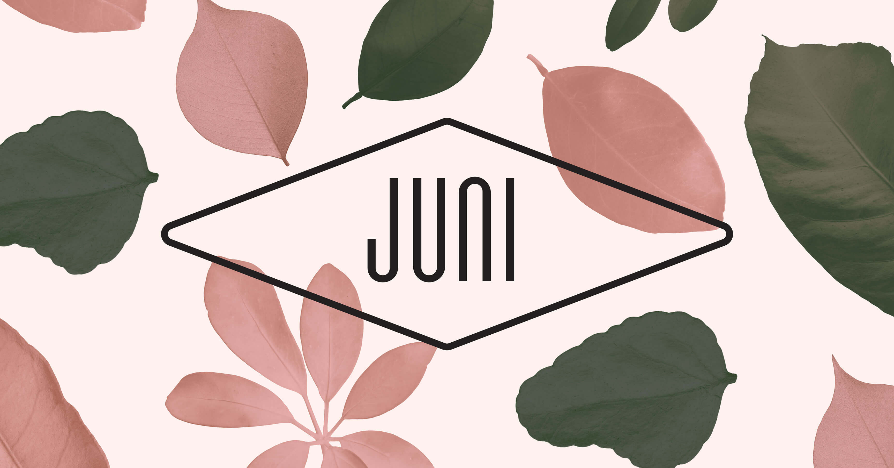
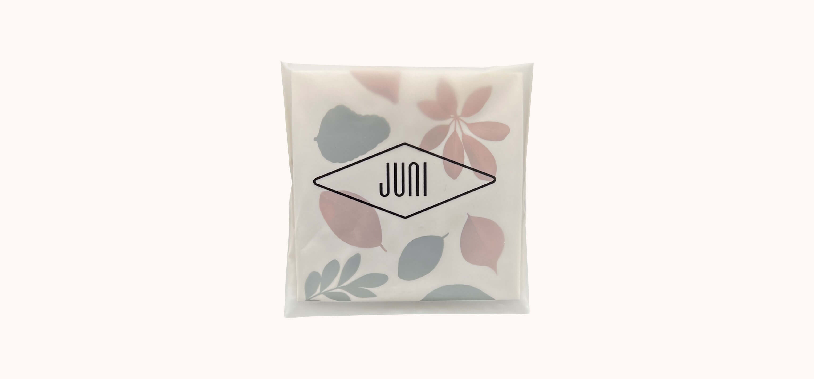

---
# Metadata
title: "Juni"
type: "Branding, Packaging"

# Thumbnails
thumbnail: "./thumbnail.jpg"
og: "./og.png"

# Options
path: "/juni/"
order: 2
---

<article role="article">

The happiest day of my life was a Thursday in 2019. Just an unremarkable blip in most people’s lives, that day, but it’s forever seared into my memory like no other. At 4 a.m. on that Thursday, I held my daughter for the first time. As I looked at her, sleeping peacefully in my arms, I tried to grasp just how much my life was about to change.

A couple of months later, I realized I had been way off. For the first six months or so, everything was much, much harder than I had anticipated. Our daughter turned out to be extremely colicky, which resulted in very long, very intense crying sessions. She would spend most of her waking time screaming her little heart out, and she would only calm down if we held or rocked her to sleep pretty much 24/7. Because we were living far away from family and friends, that task fell exclusively on me and my wife. We would take turns holding her, and sleep whenever we could. Eating became secondary. Showers were an occasional luxury. So my wife and I did the logical thing: we decided to start a side project.

</article>

<article role="article">

My wife had floated the idea of starting her own brand of clip‑on earrings multiple times before. She loves earrings but never got her ears pierced due to an allergic reaction, so she can only use the kind that clips to your ear. Unfortunately, decent clip‑on earrings are hard to come by. Almost no brands carry them and, when they do, they’re either very basic or poorly built (or, most likely, both). So we thought: maybe we’ve got a “scratch your own itch” kind of thing going on here.

Laying awake at night for hours on end trying to rock a baby to sleep is, of course, extremely tiring. But it also gives you plenty of time to think. And so, through all of the crying, the shushing, and the singing in our daughter’s ear, we began making plans.

It started with the name. That was an easy one: Juni, the Swedish word for June. It’s the month I met my wife, and the month our daughter was born. Then came the logistical side of it: finding good, reliable partners who could help us manufacture high‑quality clip‑on earrings that looked good and were comfortable to wear. We had no time to simply pick up the phone and call manufacturers during the day—and we definitely couldn’t go and see them in person. So we’d just send typo‑riddled e‑mails in the early hours of the morning, written on a phone with the hand that wasn’t holding a baby. After a lot of hard work, and a fair amount of luck, we found partners we could trust. We did the whole dance of putting orders in, getting proofs in the mail, sending them back, making adjustments; all over e‑mail and without leaving our apartment once.

Over time we grew our inventory, and we put together a collection we were happy with. That we had no way to actually sell any of it seems, in hindsight, like an issue we should have anticipated. But you know what they say: sleep deprivation is a hell of a drug. Luckily, as time went on, what everyone kept telling us would happen finally did: it became easier. Our daughter cried less, slept better, and we suddenly had a little bit more time to work on the brand, the website, and the marketing strategy.

</article>

<article role="article">

This being mainly the result of my wife’s vision, I wanted to model the brand after her personal taste. I knew she would want it to have a floral theme, and for it to look elegant and mature.

> I knew she’d want it to fit neatly into your average Instagram fashion hashtag, but with a slight indie slant.

So I grabbed a huge collection of high‑quality scans of flowers and leaves I had laying around and started trying to put them together. We sprinkled in a very restrained color scheme and a quasi‑brutalist logo and there it was: the exact balance we were looking for.

The floral motifs take center stage and remain more or less unchanged across all applications. To ensure the brand remains fresh and flexible, we made sure to shuffle elements around as much as possible. Similarly, we rely on different color schemes to denote special occasions (like the red and pink for valentine’s day) or seasonal drops (like the blue and orange for our Summer collection).

</article>

<article role="article">

> An aspect we put a lot of thought into was the packaging. We devised a solution that is practical and safe, with a minimal carbon footprint.

It consists of a piece of recycled paper, that protects the earrings during shipment but can act as a display stand for them as well. It has a pair of die‑cut holes to hold a spare set of ear lobe savers—two little pieces of white rubber that slide into a slot in the earring’s clips, to reduce pressure on the ear when in use. Once folded, the card slides into a compostable bag made out of fermented corn starch. A logo printed on the bag lines up with the pattern on the card, giving the brand an extra bit of depth. These bags are then shipped inside envelopes padded with a recycled paper filling—an alternative to the more common bubblewrap ones—which means we use no plastic in the entire process.

</article>

<iframe class="video" src="https://player.vimeo.com/video/766703097?autoplay=1&loop=1&title=0&byline=0&portrait=0" width="4800" height="2700" frameborder="0" webkitallowfullscreen mozallowfullscreen allowfullscreen></iframe>

<article role="article">

In hindsight, the reason we decided to launch ourselves into a side business like this, at a time when our lives were already going through massive change, is obvious. We were looking for something to keep us grounded. Being a first‑time parent can be brutal—more so if you don’t have a proper support network close by. And it’s very easy to let yourself get sucked into a spiral of despair.

> For me and my wife, having a goal we could work towards, outside of parenting, was crucial. It kept us sane and in touch with the world outside. And that made us better parents.

I’m glad we did it, and I’m happy to report we’re still running our small side‑business from our home office to this day. Now with the help of our beautiful daughter.

</article>