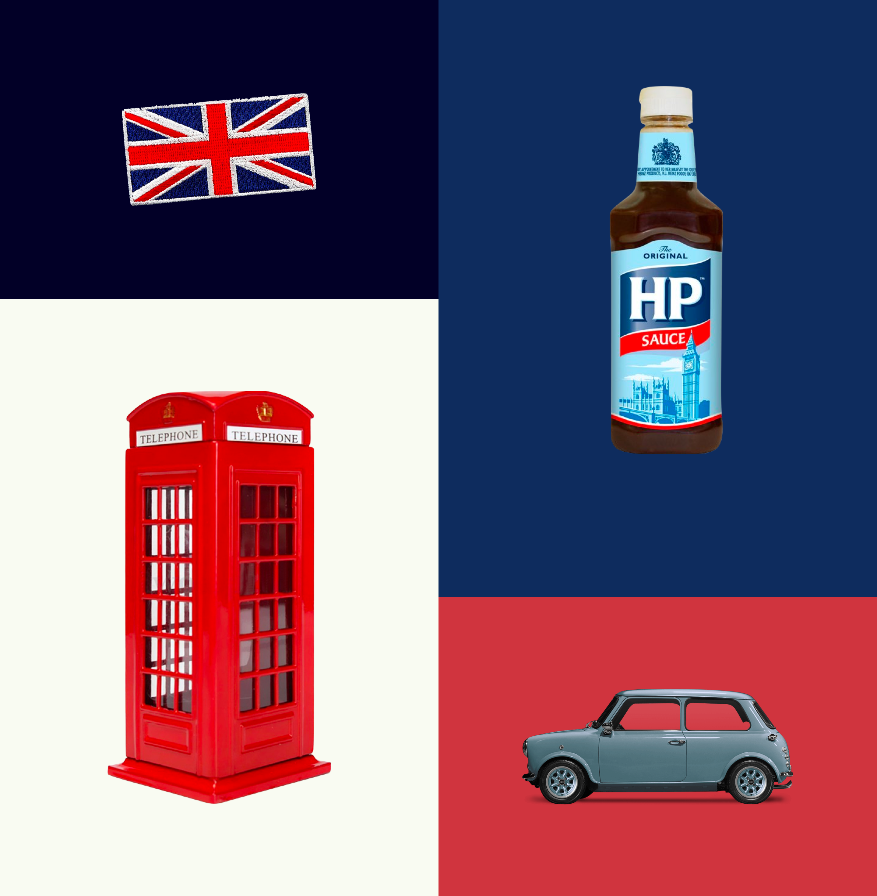
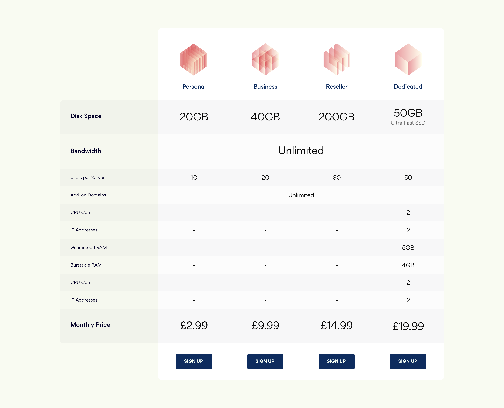
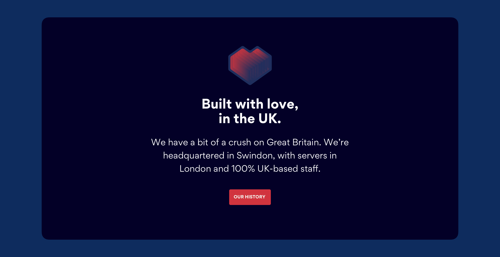
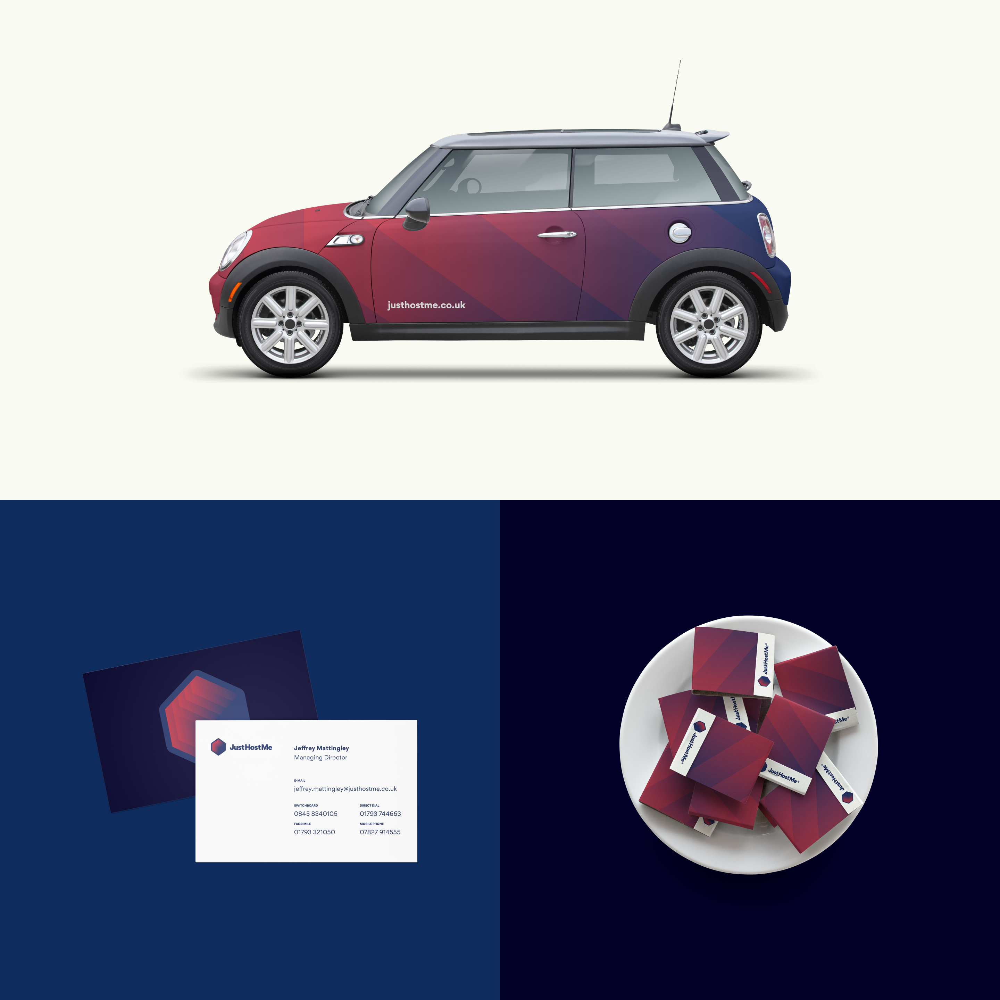

---
# Metadata
title: "JustHostMe"
type: "Branding + Web"

# Thumbnails
thumbnail: "./thumbnail.jpg"

# Options
path: "/justhostme/"
order: 3
---

<article role="article">

JustHostMe is a British Web hosting company founded over a decade ago. They provide traditional hosting solutions for individuals and businesses worldwide, and were trying to consolidate their position as one of the few hosting companies entirely based and staffed in the UK. They asked [Kollegorna](https://www.kollegorna.se/en/) to freshen up their brand and redesign their website, a process I was lucky enough to lead.

After our first few meetings, it became apparent the client was looking to cater to a mostly British audience, marketing themselves as a trustworthy national enterprise that, besides offering British Web hosting servers, would also provide customer support through a team of UK-based staff members always ready to help out. So we set out to design a brand that hinted at British culture and pride, without making it feel exclusive or uninviting to customers worldwide.

</article>

<article role="article">

We chose to start from a list of Great Britain's clichés, identify their core features and gradually remove any visual references to them, until we were left with a set of colours and a geometric sans-serif typeface that pays tribute to historically remarkable British typography.

> We turned their logo into a vessel: a small glowing container you can fill up with your own things, and that's yours to keep or share with the rest of the world.

Because the brand was to be used almost exclusively on screen, we were able to make extensive use of gradients in the logo — something that wouldn't fly with a lot of clients. Luckily, this client was totally on board with it, especially after we presented the several ways in which the cube and the gradients could be used to convey information — which we ended up doing for the hosting plan icons.

</article>

<article role="article">

As we were planning the new site, we figured the one thing a Web hosting company cannot afford to have is a slow and bulky Website. Having a great infrastructure goes a long a way, of course, but we figured design could give them a bit of a push as well.

> So we designed the site to use **a total of zero bitmap images**; every single icon and illustration on the website is 100% vector.

This makes every page on the site weigh less than 100Kb, which means it loads blazingly fast — almost uncannily so. We actually considered artificially delaying page loads, to make them look a bit more natural but, in the end, we just rolled with it.

</article>

<article role="article">

JustHostMe is a traditional Web hosting company operating at a time when the market space is rapidly being taken over by internet giants, whose infrastructure allows them to provide their services at close to no cost. So the amount of effort required to just keep your business afloat increases exponentially. For JustHostMe, the strategy has been to target small creators and business owners who would rather pay an extra couple pounds for a service that feels personal and close to home, and that is willing to provide some hand-holding as they try to get their hobbies and businesses on-line. It's a model I have great respect for, and that I felt honoured to be a small part of.

</article>