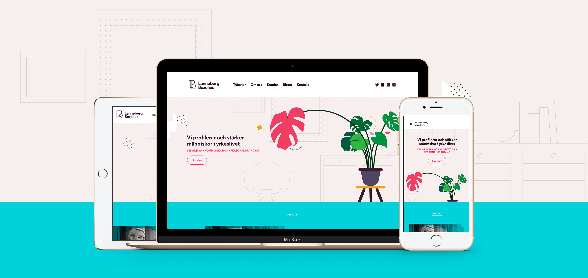
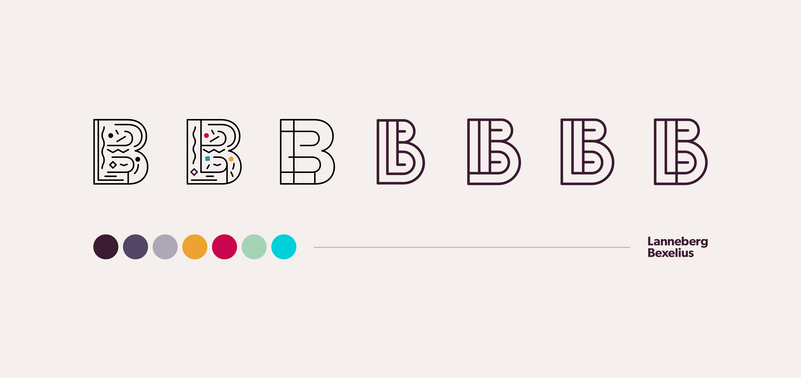
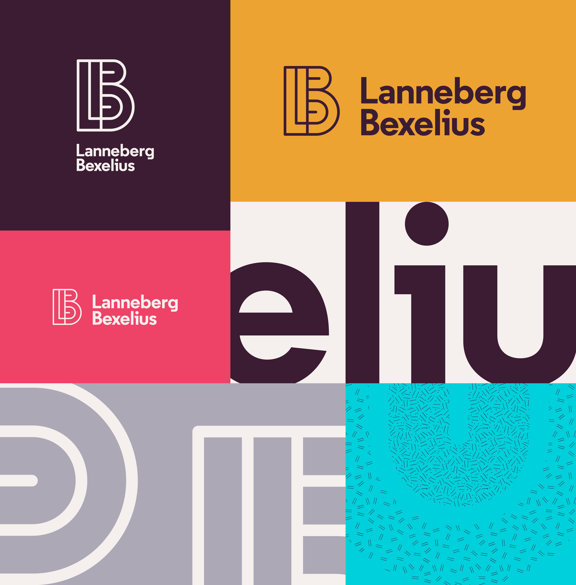

---
# Metadata
title: "Lanneberg Bexelius"
type: "Branding + UI"

# Thumbnails
thumbnail: "./thumbnail.svg"
og: "./og.png"

# Options
path: "/lannebergbexelius/"
order: 6
---

<article role="article">

Lanneberg Bexelius is a Stockholm-based personal branding consulting company run by Pia Lanneberg and Kristina Bexelius. They work within a field that is increasingly relevant, but not always easy to describe—something I can relate to. Put simply, Pia and Kristina are really good at sitting down with people, finding out what their personal and professional goals are, and figuring out ways in which their communication and thought process can be improved, to get as close as possible to achieving those results in as little time as possible.

They came to [Odd Camp](https://www.odd.camp/) asking for help setting up a couple of Websites: one they could use to promote their custom-tailored services (where they work directly with people's specific goals), and another one where they would sell access to e-learning courses (essentially, video lectures and reading materials). Somewhat paradoxically, however, they had no visual identity, so I suggested we should start there.

</article>

<article role="article">

The brief for the brand was quite open, with only one request: don't make it too solemn. Because most of the clients they work with are people in leadership positions, companies operating in this segment of the market tend to look way too corporate. And boring. Lanneberg Bexelius wanted none of that. They didn't want to be seen as suits helping other suits.

> They wanted to be seen as people helping others find out how they are perceived by their peers, how they **would like** to be perceived, and what they can do to reconcile the two.

We figured: if we're going to make something that feels personal and approachable, we might as well do it by designing the brand to channel Pia's and Kristina's personalities. So we spent some time floating ideas around, trying to boil their tastes and influences down to a set of core elements we could combine to make up a brand. What we ended up with is a vibrant colour scheme, a pair of complementary typefaces and a bunch of simple but fun illustrations that establish a clear tone of voice for the brand. Tying it all together is a logo made up of their initials, seamlessly fused into an elegant monogram.

</article>

<article role="article">

For the promotional website, we made extensive use of the brand's vibrant colour scheme, quirky illustrations and wide typographic range. These, along with some brilliant copywriting, make for a Website that feels light and is a joy to use.

Under the hood, we employed a static site generator—specifically, [Middleman](https://middlemanapp.com/)—to turn the Ruby-flavoured code into plain HTML. The only exception being the blog section, for which we decided to use WordPress with a custom-built theme that makes the transition between both platforms seamless for the end user.

</article>

<article role="article">

In the end, both we and the client were extremely happy with the final result. I wish I could say that is always the case but, as any designer will tell you, reality is a lot more complicated.

> Good design doesn't just require good designers, it needs thoughtful and respectful clients too.

Clients who are invested in the process, but understand the designer's craft and vision and place their trust in his or her experience. By that measure, Lanneberg Bexelius would rank very highly on my client list. Their involvement was always constructive throughout, and they sought to give us the resources we needed in order to do our jobs properly, without getting in the way. It's largely thanks to them and their approach that we were able to put together a brand and Website they were very happy with.

As of 2022, Pia and Kristina have parted ways, with Pia Lanneberg continuing their legacy under the name [Innerbrand](https://www.innerbrand.se/). No involvement from my part in the current design work, except for providing support in updating the monogram—from LB to IB. Surprisingly, I think it holds up.

</article>