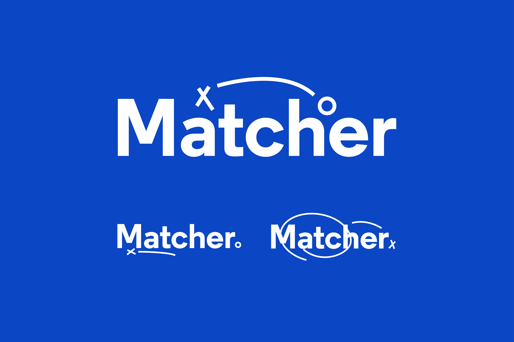
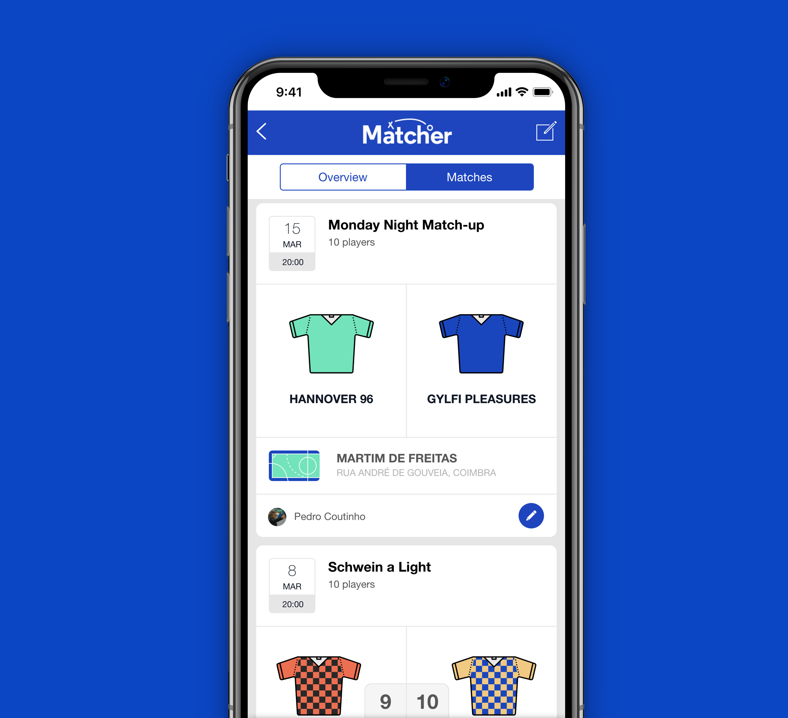
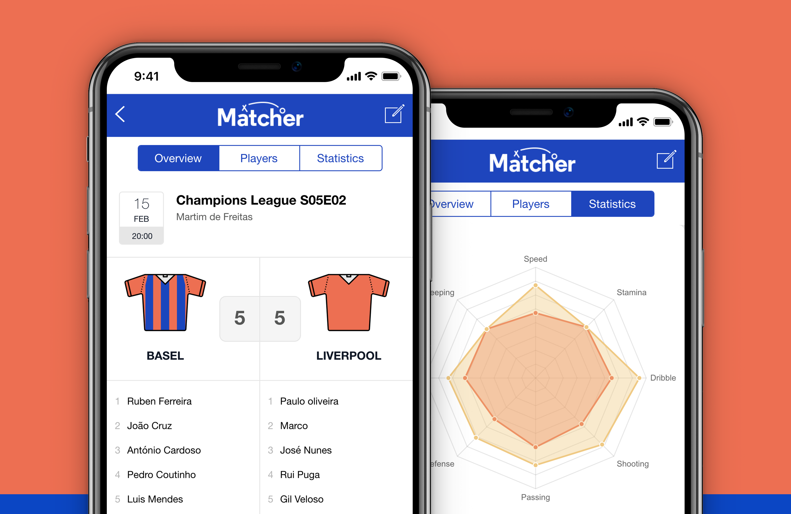
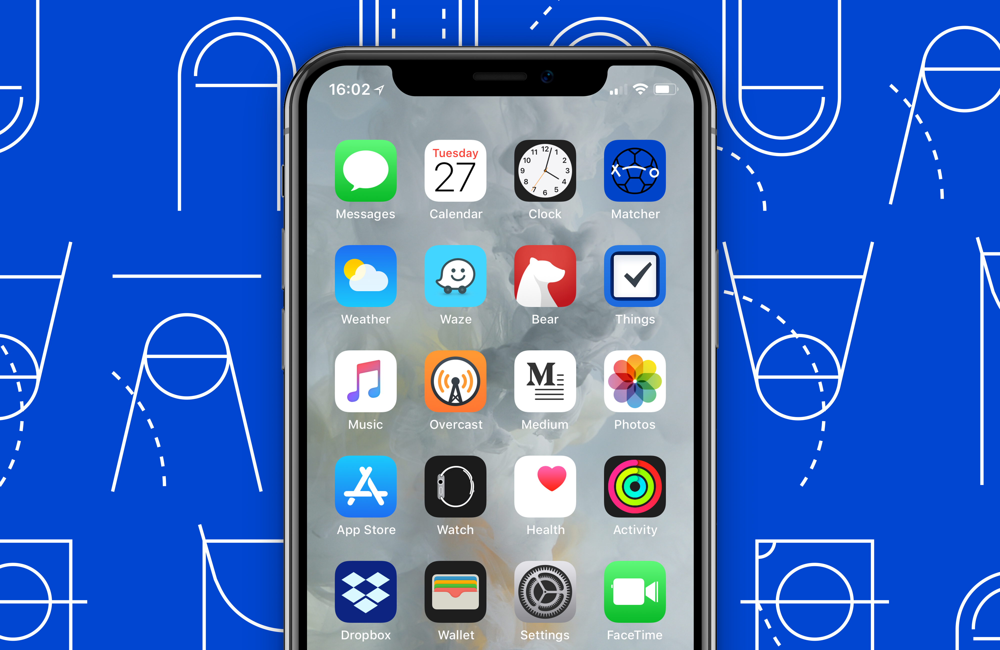
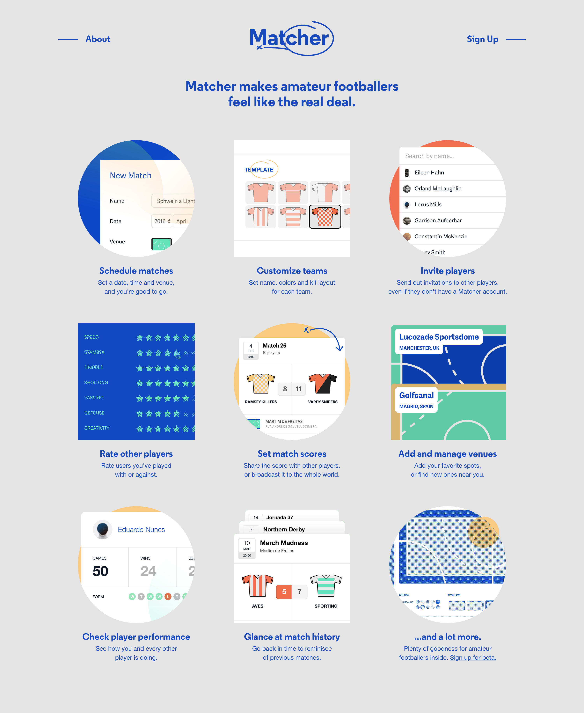
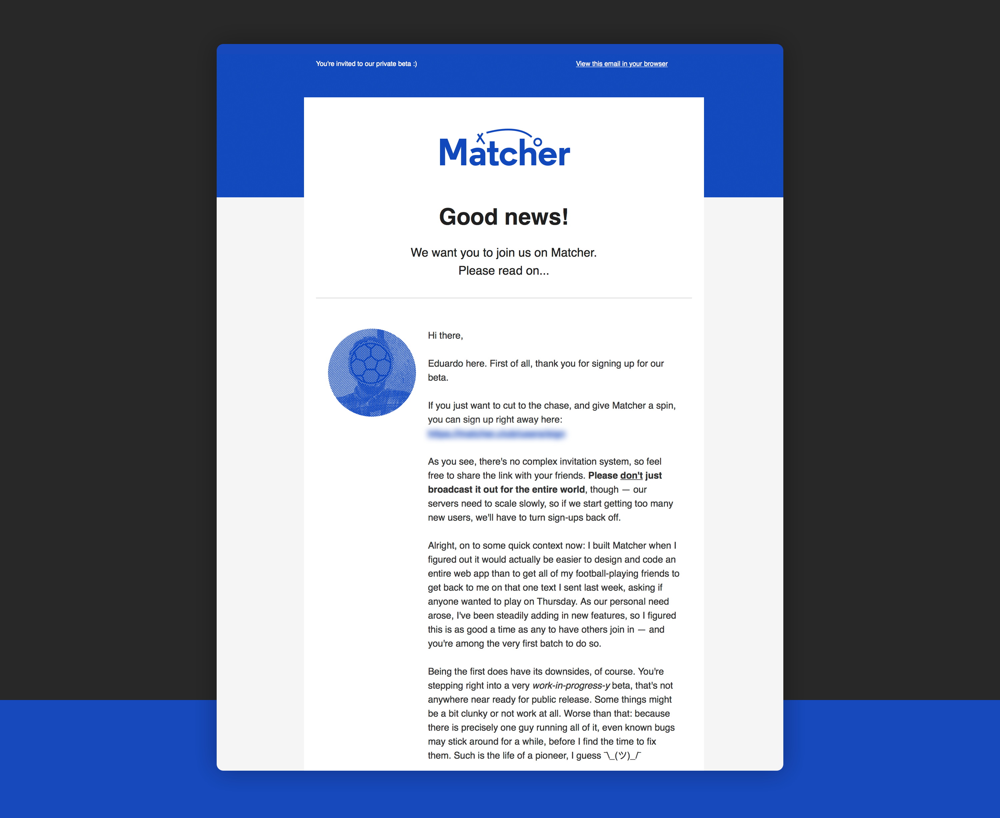

---
# Metadata
title: "Matcher"
type: "Branding + Web"

# Thumbnails
thumbnail: "./thumbnail.svg"

# Options
path: "/matcher/"
order: 1
---

<article role="article">

Sometimes, I have a slight tendency to over-complicate things. It's a flaw very few designers will admit to having, even though a good chunk of us share it. Occasionally, I will bump into a nagging issue, for which I know there are a million different solutions, and I will choose what is arguably the hardest, most time-consuming one. That's how Matcher came to be.

Matcher is a small Web app that seeks to solve a very specific problem: scheduling amateur sports matches. I used to play football with a few friends on a weekly basis, and after a short while the logistics of it got a bit out of hand. One of us would have to take the better part of a day off every time, to try and get everyone to RSVP, find a date and time that fit everyone's schedule and split the group into well-rounded teams. So I took the chance to scratch my own itch and designed a small Web app that fixed all of it for us. Only, I over-did it a bit.

</article>

<article role="article">

I started out by enlisting the help of my good friend and developer-extraordinaire [Filipe Pires](http://www.filipepires.me) to put together an algorithm that would take a certain number of players, along with some skill stats we got everyone to compile, and generate the most tightly balanced set of teams possible. It worked nicely for a while, but because we had to feed the algorithm all of the stats manually, it actually turned out to require more work than before, so we went looking for a way to automate the process somehow. The answer was a small Web app where users could do it all: rate people they've played with according to a set of stats, create matches, invite other players, set up balanced teams, etc. I had just started working at [Kollegorna](https://www.kollegorna.se/en), where Ruby on Rails was king, so I took the chance to teach myself some Rails and started building what would eventually become Matcher.

But first, we needed a brand.

</article>

<article role="article">

Quite frankly, this was one of the rare cases where the brand pretty much designed itself. For the logo, A2 Type's outstanding [Regular](https://www.a2-type.co.uk/regular) pulls most of the weight, paired with some scribbles straight out of Coaching 101. The scribbles follow a bit of a pattern, but can be used in a number of different ways, keeping the logo recognizable but never boring. As for the colour scheme, it's ripped right off of the courts we used to play in. Perhaps unsurprisingly, I've come to realize these look more or less the same anywhere in the world, almost always using a combination of 2 out of 4 possible colours. I simply added them all together, and we had a brand.

</article>

<article role="article">

With the brand settled, it was time to move on to the UI. One of the biggest temptations, when you're designing an app like this, is to focus on the desktop experience first and then try to gracefully degrade it so it fits on smaller screens. I went with the opposite approach: started out by designing everything mobile-first, and then tried to scale it up so it looks good everywhere. In all fairness, the app still ended up looking better on phones than it does on desktop, but I'm happy to report that it's just as usable on every device — and all versions share the exact same set of features.

</article>

<article role="article">

As soon as we had something that was barely usable, we started using it to schedule our own matches. Calling the first version we launched an MVP would be an overstatement, yet it worked surprisingly well for us so, after a few months of testing and improvements, I decided to open up a closed beta. I put together a small little promotional page for it, and used Mailchimp to set up an half-baked beta sign-up system. Because it's still a bare-bones app, hosted on a cheap heroku dyno, I'm taking a cautious approach and only letting in small groups of users at a time, but the response so far has been encouraging. Sadly, the amount of time I can invest in it at this point is very limited, so development at the moment feels a lot like what our football matches used to be: slow, largely uneventful but still immensely rewarding.

</article>

