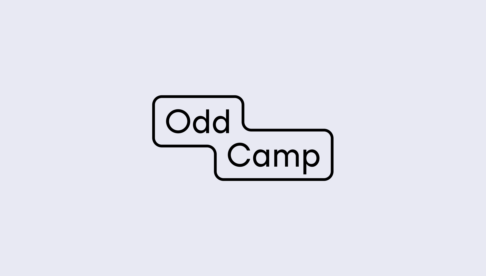
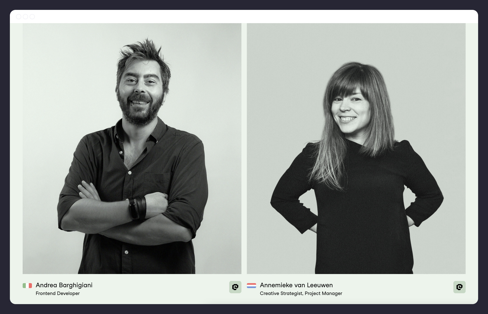

---
# Metadata
title: "Odd Camp"
type: "Branding + UI"

# Thumbnails
thumbnail: "./thumbnail.svg"
og: "./og.png"

# Options
path: "/oddcamp/"
order: 4
---

<article role="article">

Back in 2015, I was teaching design, working part-time at a design studio, and moonlighting as a frontend developer—a very exhausting and productive period of my life. My distrust of social networks had not yet fully materialized, and though I wasn't exactly keen on over-sharing, I was an active member of a few online communities. Through one of those communities, the folks at what was then called Kollegorna (a small Webshop based in Stockholm that had started exploring the concept of going entirely remote) saw my work and reached out to me. They were looking for a designer who could code and figured I might fit the bill. I decided to give it a go. Fast forward a couple of years, and I'm being invited to become a partner and take up the role of Head of Design. I was still figuring out how to pronounce "Kollegorna" but agreed nonetheless.

We grew a fairly solid reputation in and around Stockholm, but as we started taking in work from outside of Sweden, the company's name became increasingly problematic. So I used what little influence I now had to push for a name change and all of our public communication to default to English—everyone speaks it in Sweden anyway. It took some convincing, but I eventually got my partners on board. In early 2021, as the world naively prepared to put a shitshow of a year behind it (which, as we now know, worked out great), we decided the time was right to rename and rebrand ourselves.

</article>

<article role="article">

I have this document where I usually write down random thoughts and ideas that cross my mind on occasion. It's where the vast majority of my ideas go to die. Now and then, I manage to repurpose one of these assorted thoughts into something useful that I can incorporate into my work. When we started brainstorming a new name for Kollegorna, I went to see if my little idea book could be of use. I came across Odd Camp—a combination of words I had written down for a reason I can no longer recall—and something about it felt right.

> It sounded different yet strangely familiar and projected that aura of independent studio we were looking for, without feeling cheap or amateurish. Plus, it really rolled off the tongue.

It was available for trademarking, the .com wasn't taken, and—much to my surprise—neither was [odd.camp](https://odd.camp). It all clicked into place.

We ran some very unscientific user research to make sure the name wouldn't come back to bite us for some reason we couldn't foresee (did you know: ODD is the acronym for Oppositional Defiant Disorder, and there are actual ODD Camps?). Luckily, we found nothing that would seriously discourage us, so we were off. Now we just needed a brand.

</article>

<article role="article">

We had just recently grown our design team—by hiring [Diana](https://www.oddcamp.com/diana) and [Joana](https://www.oddcamp.com/joana), two brilliant designers I had met back in college—so this was the perfect opportunity to dip our toes into some branding work. We had a very clear idea of what sort of concepts we wanted the brand to communicate: that we blend design and engineering in equal parts; that we are curious; that our team is culturally diverse yet bound together by common interests, backgrounds, and cultural references; that we think of technology as a means to an end, not as an end in and of itself; that we don't take ourselves too seriously. Putting all of it into a brand is no easy task, so the first attempts were a bit off.

Early in the process, I got attached to the idea of badges—as in the kind you might get at a summer camp. I have zero personal experience with summer camps, so I have no idea what I'm talking about, but there was something about the concept of using badges to highlight different types of skills, valuing them all equally, that resonated with me (also, my daughter was going through a big [Hey Duggee](https://www.heyduggee.com/) phase, so that may have helped). We tried out different ideas around it but kept coming up short: everything ended up being too rigid and leaning too heavily on the summer camp association.

But then, as Diana began to branch out of the original concept, some of her sketches started to look less like badges and more like the old-school tag clouds we all remember fondly from our days as young, clueless kids exploring the Web for the first time. Others reminded us of the stickers most of us slap all over our laptops. And as we started to steer away from the illustration-heavy universe of camp badges into a more typographic realm, that made it much easier for us to give the brand a unique voice through text while still connecting to all of those visual metaphors.

</article>

<article role="article">

The final brand consists of a modular logo and a set of badges that complement it. Badges can be used in several different ways, from headings on documents to labels or tags on our website. We use them in business cards and e-mail signatures. They can be used to inform, to tell a story, or as a joke. And, so long as all badges follow the same set of rules and tone of voice, they allow the brand to sprawl and evolve cohesively. We even devised a simple tool that lets anyone in the team build badges according to this spec, regardless of their experience with design (Figma turned out to be perfect for this). We called it Badger.

Finally, we sprinkled a few extras on top—like the shapes framing the photographs or the colorful abstract clouds seen in some backgrounds—and packaged it all into [these brand guidelines](https://www.figma.com/proto/D4c6PmplUVPbTYtmZZuGga/Odd-Camp-Brand-Guidelines?page-id=455%3A11&node-id=455%3A404&viewport=477%2C48%2C0.12&scaling=min-zoom&starting-point-node-id=455%3A404). It has checked all the boxes for us so far, and we're excited to see where it goes next.

</article>