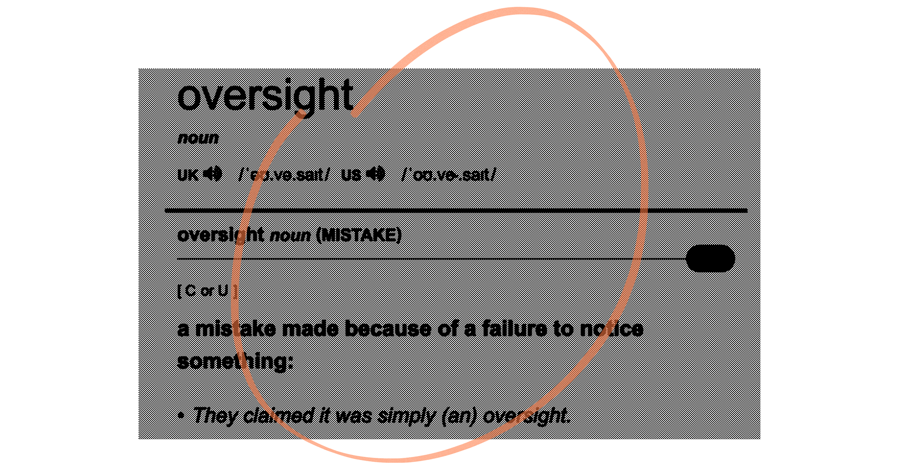
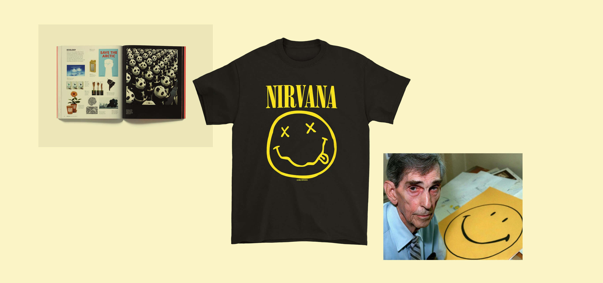
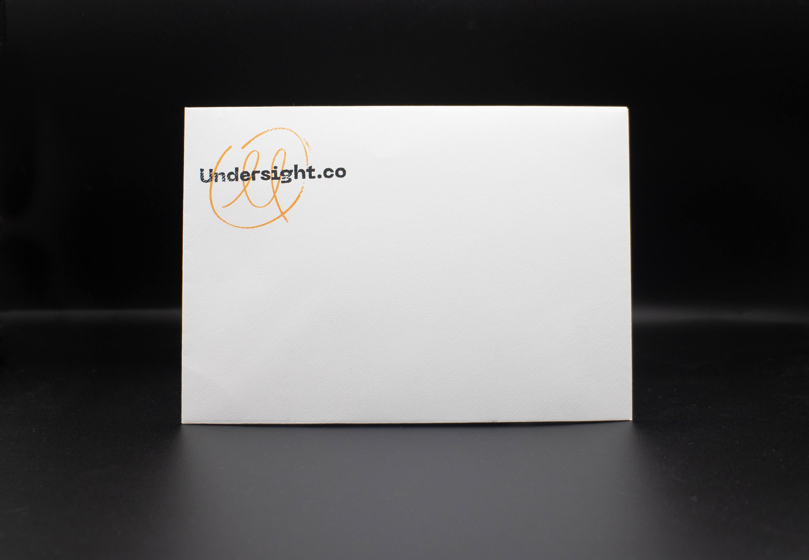
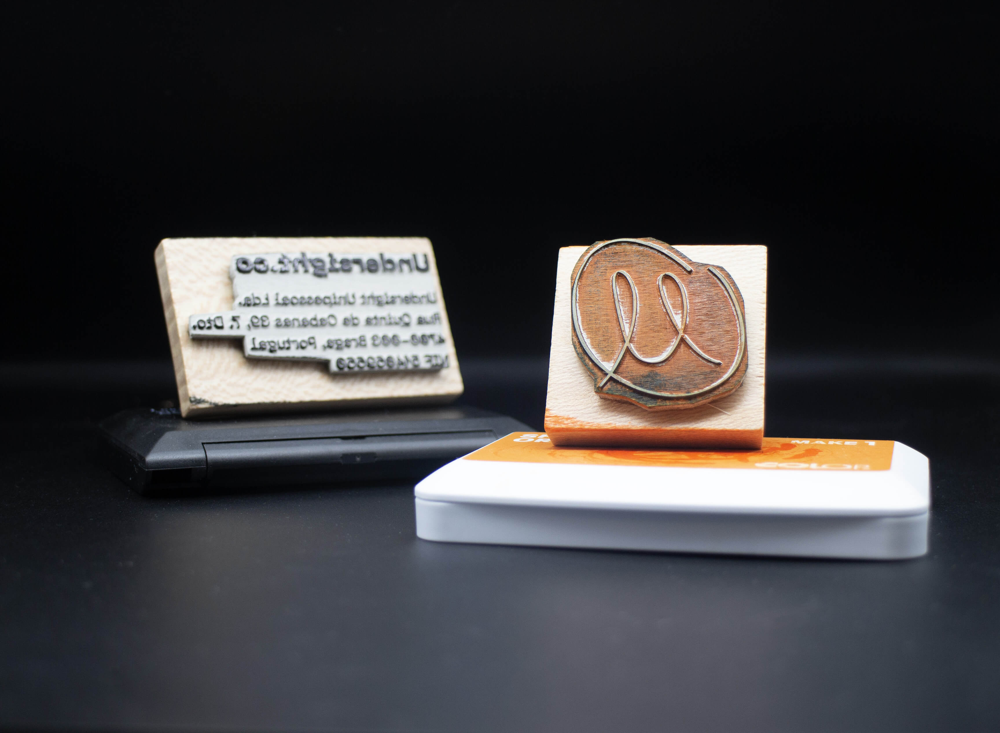

---
# Metadata
title: "Undersight"
type: "Branding"

# Thumbnails
thumbnail: "./thumbnail.jpg"
og: "./og.png"

# Options
path: "/undersight/"
order: 4
---

<article role="article">

Picture this. It's a hot summer day in Portugal and I'm sitting in a poorly‑ventilated government building. I'm here to set up a tiny one‑person company for myself, hoping to level up my freelancing operation somewhat. The day has dragged on, I'm exhausted, and I have all but decided to pack up and leave when my number is called. I sit down, hand in all of the paperwork, and hear back: “so, have you thought about what you want to call the company”? Obviously, I have not.

I now have a few seconds to come up with something I will have to live with for (hopefully) many years to come. Worse still, I apparently have to volunteer not one but three entirely different names, just in case a couple of them are already taken or get rejected for some reason. I tell the clerk I had thought of every single detail but had somehow forgotten about the name. She doesn't look too happy, and I apologize for the oversight. I'm briefly tempted to call the company *oversight*... at least I'd get a story out of it. I quickly realize the implications of calling any business (let alone a design one) that and decide against it.

</article>

<article role="article">

I dwell on it a bit longer and figure: if oversight is the unintentional failure to notice something, I'm actually trying to be the exact opposite of that.

> I want my work to direct people's attention to things that would otherwise go unnoticed.

I try to think of an antonym. Something like *undersight*, perhaps... Is that a word? Probably not.

With little time to spare, I tell the clerk that's what I'm going with. She seems unimpressed and dryly asks me about the other two names. I'm fairly confident I'll get the first one, so I offer up a couple of very forgettable generic names I immediately forgot. I go back home slightly disappointed with myself, sit down at my desk, and google the word. It's not a word. I shrug and start working on a brand for my company-to-be.

</article>

<article role="article">

Despite the adverse conditions it was born in, I became very fond of the name over time. The more I wrote it down, the more I liked it. Eventually, I found out someone else had already come up with the word undersight (to describe [Sousveillance](https://en.wikipedia.org/wiki/Sousveillance), an antonym to a different meaning of the word oversight). That didn't ruin it for me. Neither did the fact that it's virtually impossible to have people spell it correctly over the phone (underside, undersite, undersign... I could go on).

> In fact, I was quite happy with how the made-up definition of this made-up word relates to my own experience discovering graphic design as a teenager.

It brought me back to the late 90's, reading [A Smile in the Mind](https://en.wikipedia.org/wiki/A_Smile_in_the_Mind) for the first time. Being awe-struck by witty ideas you wouldn't immediately get, but hit you like a freight train when you finally did. I wanted that to transpire, somehow, into my own brand.

I eventually found something that I felt conveyed those exact feelings. It's so simple that I'm slightly ashamed it took me so long to get there: it's a hand-drawn lowercase u that doubles as a smiley face. Fun but slightly unsettling—like Nirvana's smiley face logo. Simple but with depth and personality—like the Harvey Ross Ball original.

</article>

<article role="article">

I've paired it with Pangram Pangram's [Neue Machina](https://pangrampangram.com/products/neue-machina) where needed—though, frankly, I'm pretty happy using as little type as possible for it. I printed no stationery. Everything is created on the fly, as needed, with paper stock, envelopes, and a couple of rubber stamps.

I eventually stopped doing freelance, but I kept the name, the domain, and this website. I've lived with it for a few years now, and I'm still pretty happy.

</article>

